# PI-CAI Prostate Cancer Classification: Three Input Encoding Strategies for MedViT

**Task**: Binary classification of prostate cancer patient studies into clinically significant (csPCa) vs. clinically insignificant (ciPCa) using multi-modal 3D MRI.

---

## Table of Contents

1. [Background](#1-background)
2. [Dataset](#2-dataset)
3. [Common Architecture](#3-common-architecture)
4. [Method 1 — Weight Tiling](#4-method-1--weight-tiling)
5. [Method 2 — Channel Adapter](#5-method-2--channel-adapter)
6. [Method 3 — Slice Transformer](#6-method-3--slice-transformer)
7. [Training Details](#7-training-details)
8. [Results](#8-results)
9. [Grad-CAM Visualizations](#9-grad-cam-visualizations)
10. [Discussion](#10-discussion)

---

## 1. Background

MedViT is a hybrid CNN-Transformer network pretrained on ImageNet/MedMNIST that expects a standard 3-channel RGB image as input. Applying it to prostate MRI requires reconciling a fundamental mismatch: each patient study consists of **32 axial slices × 3 modalities (T2W, ADC, gland mask) = 96 channels**, while MedViT's first convolutional layer accepts only 3 channels.

This project systematically compares three strategies for bridging this gap, each representing a different trade-off between pretrained feature preservation and end-to-end learning flexibility.

---

## 2. Dataset

**Source**: PI-CAI (Prostate Imaging: Cancer AI) challenge dataset, registered and preprocessed subset.

| Property | Value |
|----------|-------|
| Total patients | 451 |
| csPCa (label 1) | 65 (14.4%) |
| ciPCa (label 0) | 386 (85.6%) |
| Modalities | T2W, ADC (registered to T2W), gland mask |
| Input volume | `[32, H, W]` per modality → `[96, 224, 224]` after resizing |

**Data split** (stratified, seed=42):

| Split | Patients | csPCa | ciPCa |
|-------|----------|-------|-------|
| Train | 315 | 45 | 270 |
| Val   | 68  | 10 | 58  |
| Test  | 68  | 10 | 58  |

The severe class imbalance (1:6 ratio) is addressed via `WeightedRandomSampler` and weighted cross-entropy loss (`ciPCa=0.583, csPCa=3.500`).

**Input encoding**: 32 slices are interleaved across modalities:

```
channel order: [T2W₀, ADC₀, gland₀, T2W₁, ADC₁, gland₁, ..., T2W₃₁, ADC₃₁, gland₃₁]
→ tensor shape: [B, 96, 224, 224]
```

---

## 3. Common Architecture

All three methods share the same **MedViT_small** backbone (unless noted), classification head, and training recipe.

**MedViT_small** (`depths=[3,4,10,3]`, path dropout=0.1):
- Hierarchical CNN-Transformer hybrid with ECB, LTB, MHCA blocks
- Global average pool → `[B, 1024]` feature vector
- Pretrained on ImageNet (checkpoint: `MedViT_small.pth`)

**Classification Head** (depth=2):
```
[B, 1024] → Linear(1024→512) → GELU → Dropout(0.2)
          → Linear(512→256)  → GELU → Dropout(0.2)
          → Linear(256→2)
```

**Training recipe** (shared):

| Hyperparameter | Value |
|----------------|-------|
| Optimizer | AdamW |
| Backbone LR | 1e-5 |
| Head LR | 3e-4 |
| Weight decay | 1e-4 |
| Scheduler | ReduceLROnPlateau (factor=0.5, patience=10) |
| Early stopping | patience=30 (val AUC) |
| Gradient clipping | max_norm=1.0 |
| Max epochs | 150 |
| Batch size | 8 |

---

## 4. Method 1 — Weight Tiling

### Concept

The simplest approach: **inflate the pretrained first convolution** from 3→96 channels by tiling its weights 32 times.

```
Original pretrained conv:  weight shape [64, 3, 3, 3]
Tiled initialization:      weight shape [64, 96, 3, 3]
                           = repeat 32× along channel dim, then ÷ 32
```

The 96-channel input is fed directly into this modified conv. All other backbone weights remain unchanged. The inflated conv is fine-tuned at `lr=3e-4`; the rest of the backbone at `lr=1e-5`.

```
[B, 96, 224, 224]
    ↓  Conv2d(96→64, 3×3) — tiled from pretrained, fine-tuned at lr=3e-4
    ↓  MedViT backbone (stages 2–4, pretrained, lr=1e-5)
[B, 1024]
    ↓  Classification head (randomly initialized, lr=3e-4)
[B, 2]
```

### Variants explored

| Run | Loss | Backbone | Head depth | Notes |
|-----|------|----------|-----------|-------|
| `baseline` | CE | small | 1 | Initial experiment |
| `deeper_head` | CE | small | 2 | Added MLP depth |
| `focal_base` | Focal (γ=2) | small | 1 | Class imbalance focus |
| `focal_deep` | Focal (γ=2) | small | 2 | **Best AUC** |
| `base_ce` | CE | base | 2 | **Best F1** |

> `large` backbone variants (226M params) were attempted but consistently collapsed to predicting all-csPCa, confirming severe overfitting with only 45 positive training samples.

### Training curves

| | `focal_deep` (Best AUC) | `base_ce` (Best F1) |
|--|--|--|
| **Learning curve** | 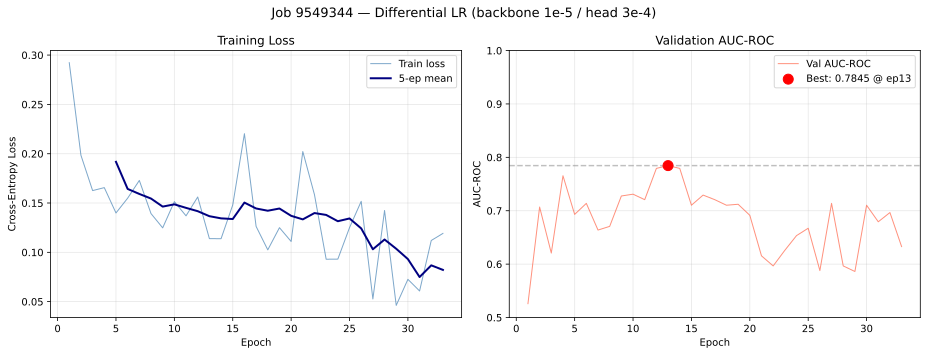 | 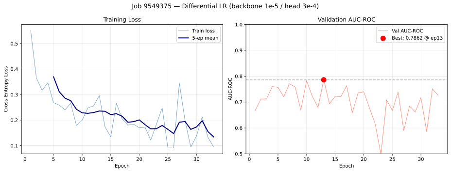 |
| **ROC + PR curve** | 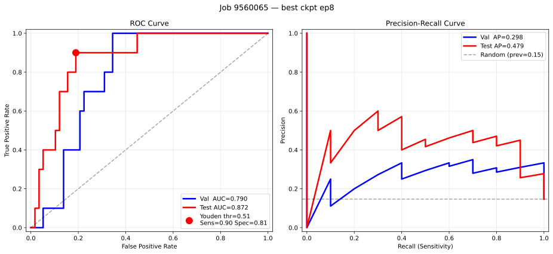 | 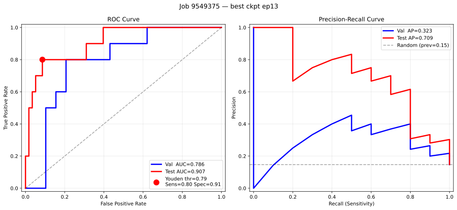 |
| **Confusion matrix** | 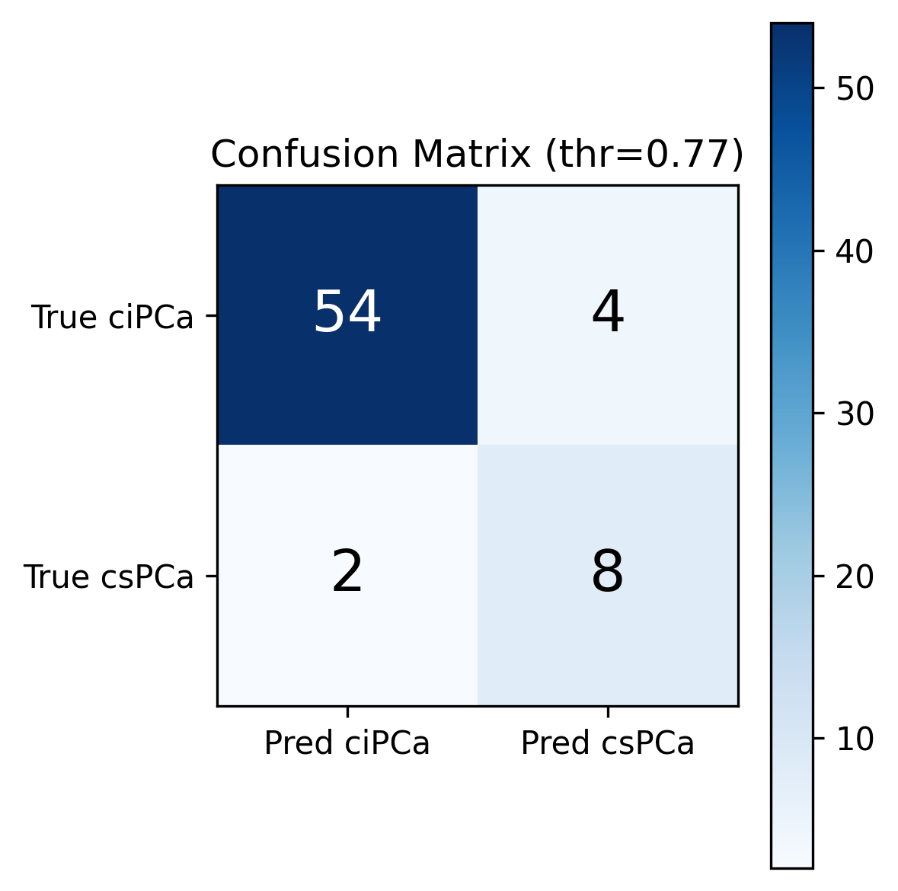 | 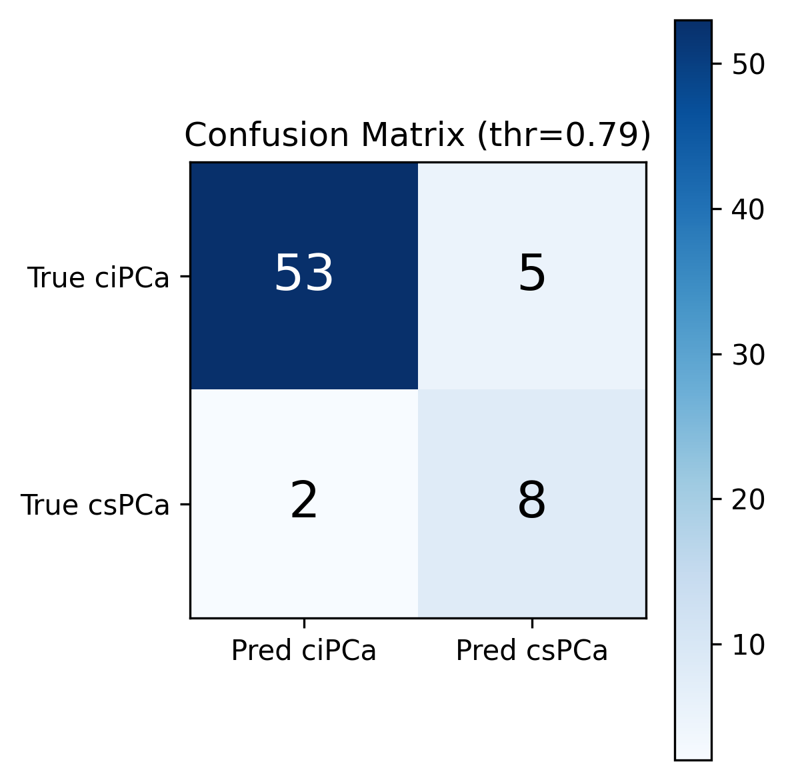 |

---

## 5. Method 2 — Channel Adapter

### Concept

Instead of modifying pretrained weights, insert a **learnable bottleneck adapter** before the original first conv — keeping the pretrained 3×3 kernel *exactly* as it was trained:

```
[B, 96, 224, 224]
    ↓  Conv2d(96→3, 1×1) — randomly initialized adapter    ← lr=1e-4
    ↓  Conv2d(3→64, 3×3) — pretrained, COMPLETELY FROZEN?  ← lr=1e-5 (fine-tuned slowly)
    ↓  MedViT backbone (unchanged pretrained)              ← lr=1e-5
[B, 1024]
    ↓  Classification head (randomly initialized)          ← lr=3e-4
[B, 2]
```

The adapter learns a *linear* projection from 96 channels to 3, compressing the multi-modal multi-slice input into a pseudo-RGB representation that the pretrained conv can process. Three separate LR groups ensure each component learns at an appropriate rate.

### Variants explored

| Run | Backbone | Adapter type | Result |
|-----|----------|--------------|--------|
| `adapter_small_*` | small | 1×1 | Collapsed (all-csPCa predictions) |
| `adapter_base` | base | 1×1 single layer | **Stable, AUC=0.881** |
| `adapter_base_mid32` | base | 2-layer (96→32→3) | Sensitivity collapsed to 0.40 |

> `adapter_small` experiments consistently collapsed because the randomly initialized adapter produces noisy outputs that destabilize the small backbone's batch norm statistics. Switching to MedViT_**base** (3× more parameters) proved sufficient to absorb the initial noise.

> `adapter_base_mid32` added a hidden layer (96→32→3 with BN+GELU) expecting richer feature compression, but the additional parameters overfitted on 45 positive training samples — sensitivity dropped from 0.80 to 0.40.

### Training curves — `adapter_base`

| Learning curve | ROC + PR curve | Confusion matrix |
|----------------|---------------|-----------------|
| 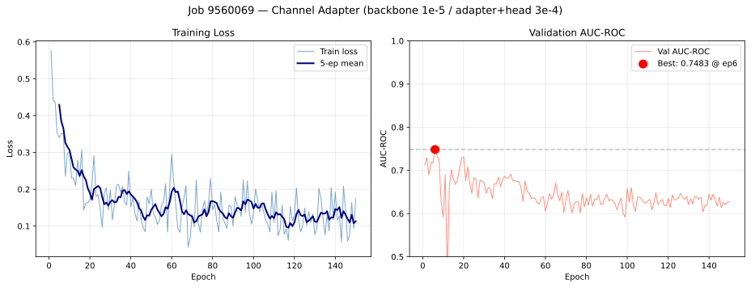 | 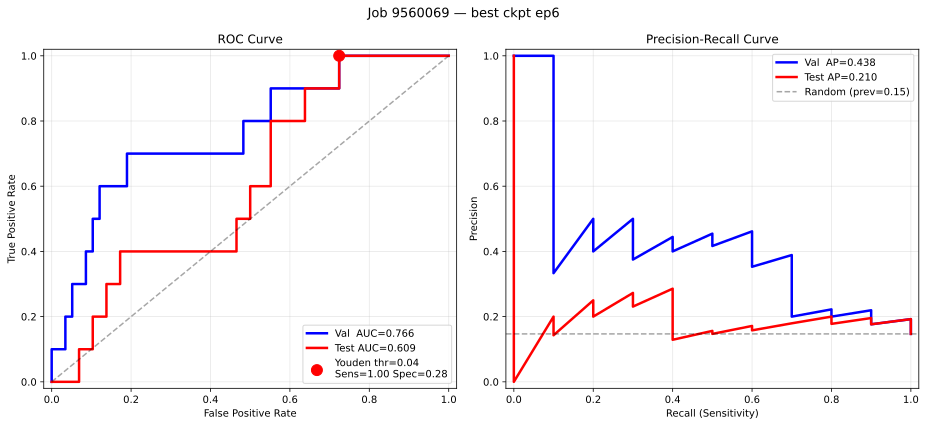 | 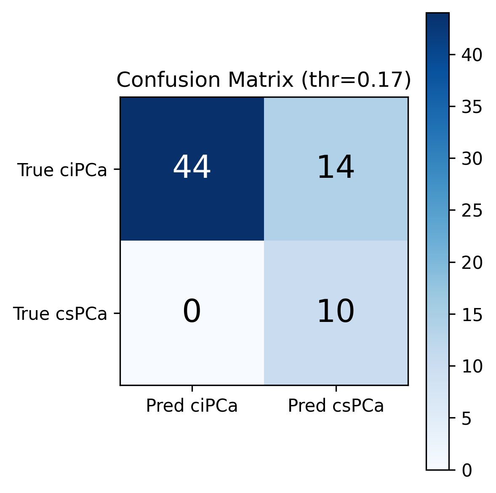 |

---

## 6. Method 3 — Slice Transformer

### Concept

Treat the 32 MRI slices as a **video sequence**: process each slice independently through the pretrained MedViT backbone (3-channel input unchanged), then aggregate the 32 per-slice feature vectors with a Transformer encoder.

```
[B, 96, 224, 224]
    ↓  reshape → [B, 32, 3, 224, 224]
    ↓  MedViT backbone (shared weights, 3ch unchanged, lr=1e-5)  ← processed per-patient to avoid OOM
[B, 32, 1024]
    ↓  prepend learnable CLS token → [B, 33, 1024]
    ↓  + learnable positional embedding
    ↓  Transformer Encoder (2 layers, 8 heads, ff=2048, lr=3e-4)
    ↓  CLS output → [B, 1024]
    ↓  Classification head
[B, 2]
```

**Key advantage**: MedViT's pretrained first conv is used *exactly* as designed — no weight modification, no adapter. The Transformer captures relationships between slices (e.g., "the lesion visible in slice 15 correlates with the texture change in slice 18").

**Memory fix**: Naively processing `B×32` images through MedViT simultaneously caused OOM (>31 GB). Fixed with a per-patient loop: `feats = torch.stack([extractor(x[b]) for b in range(B)])` — peak memory equals exactly 32 images regardless of batch size.

### Pooling strategies

- **CLS pooling**: A randomly initialized `[CLS]` token prepended to the sequence aggregates global information via self-attention (BERT-style).
- **Mean pooling**: Average all 32 slice features after Transformer processing — simpler, no extra parameters.

### Variants explored

| Run | Pooling | Batch size | Scheduler | Best val AUC | Test AUC | Status |
|-----|---------|-----------|-----------|-------------|---------|--------|
| `slice_tf_small` | CLS | 1 | CosineAnnealing | 0.824 | 0.764 | Done |
| `slice_tf_mean` | Mean | 1 | ReduceLROnPlateau | — | — | Running |
| `slice_tf_mean_bs2` | Mean | 2 | ReduceLROnPlateau | — | — | Running |

### Training curves — `slice_tf_small`

| Learning curve | ROC + PR curve | Confusion matrix |
|----------------|---------------|-----------------|
| 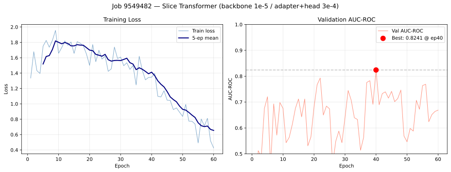 | 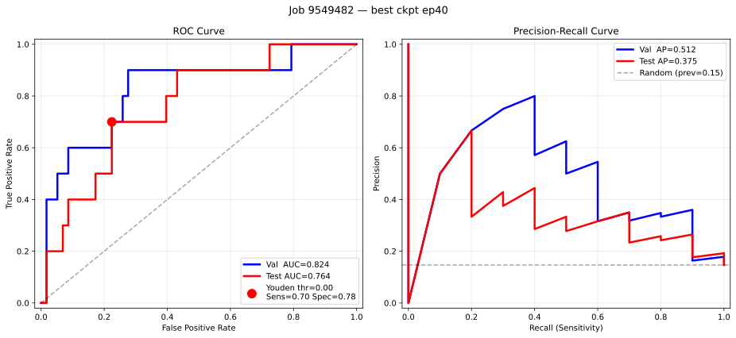 | 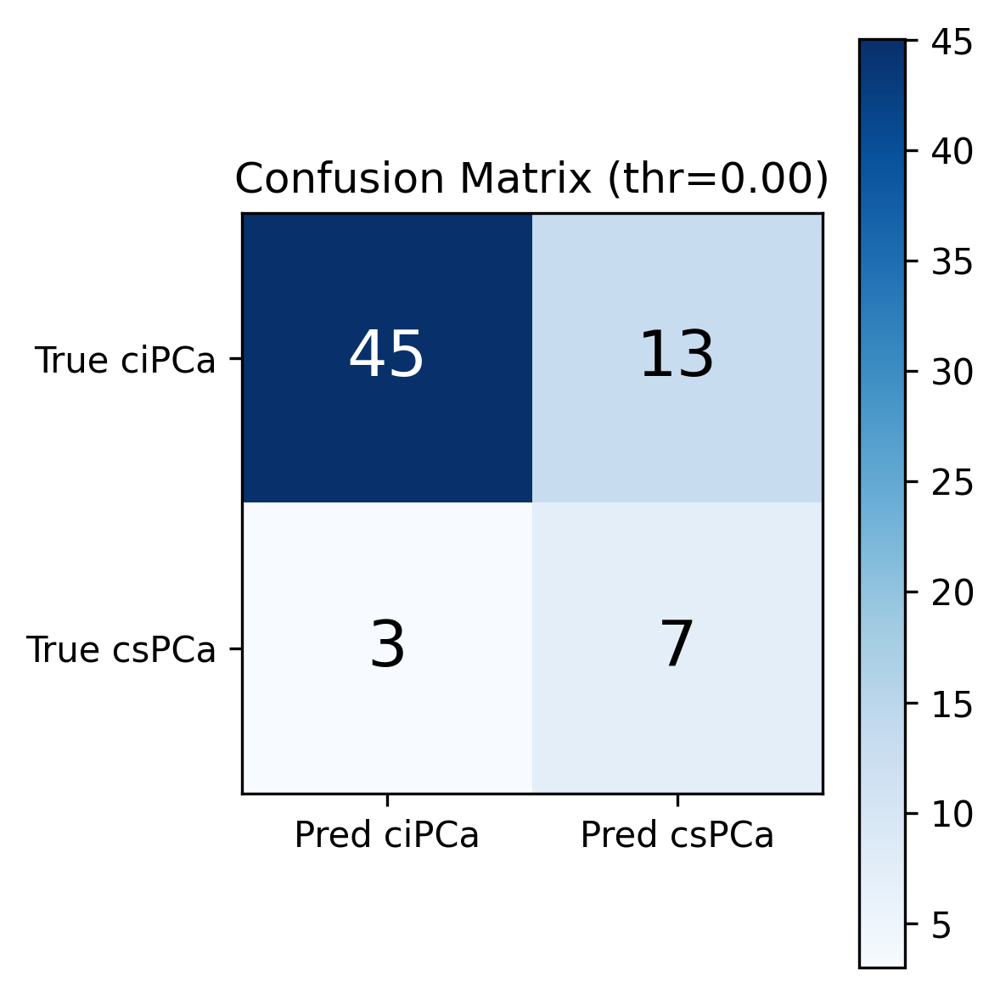 |

---

## 7. Training Details

### Loss function

**Cross-Entropy with class weights** (default):
```
weight[c] = N / (2 × count[c])  →  ciPCa: 0.583,  csPCa: 3.500  (ratio 1:6)
```

**Focal Loss** (γ=2.0, used in `focal_*` variants):
```
FL(p_t) = −α_t · (1 − p_t)^γ · log(p_t)
```
Focal loss down-weights easy negatives (confident ciPCa), focusing capacity on hard examples near the decision boundary. With γ=2, a well-classified example (p=0.9) contributes only 1% as much loss as a hard example (p=0.5).

### LR scheduling evolution

**CosineAnnealingLR** (early experiments): Decays LR on a fixed schedule regardless of validation performance. In `slice_tf_bs2`, best val AUC was reached at epoch 10, but LR was already decaying — the model could not recover from the subsequent plateau, triggering early stopping at epoch 30.

**ReduceLROnPlateau** (current default): LR halved whenever val AUC fails to improve for 10 consecutive epochs. When LR actually drops, the early stopping patience counter resets to 0, giving the model a fresh chance:

```python
old_lr = optimizer.param_groups[1]['lr']
scheduler.step(val_auc)
new_lr = optimizer.param_groups[1]['lr']
if new_lr < old_lr:
    patience_count = 0  # reset: model gets another 30 epochs after each LR drop
```

---

## 8. Results

### Performance summary — Test Set (68 patients: 10 csPCa, 58 ciPCa)

| Method | Run | Test AUC | Sensitivity | Specificity | F1 (csPCa) | TP | FP | TN | FN |
|--------|-----|---------|------------|------------|-----------|----|----|----|----|
| **Weight Tiling** | `focal_deep` | **0.919** | **0.90** | 0.78 | 0.563 | 9 | 13 | 45 | 1 |
| **Weight Tiling** | `base_ce` | 0.907 | 0.80 | **0.90** | **0.667** | 8 | 6 | 52 | 2 |
| **Weight Tiling** | `deeper_head` | 0.898 | 0.90 | 0.83 | 0.621 | 9 | 10 | 48 | 1 |
| **Weight Tiling** | `baseline` | 0.898 | 0.90 | 0.76 | 0.545 | 9 | 14 | 44 | 1 |
| **Weight Tiling** | `focal_base` | 0.822 | 0.80 | 0.83 | 0.571 | 8 | 10 | 48 | 2 |
| **Channel Adapter** | `adapter_base` | 0.881 | 0.80 | 0.84 | 0.593 | 8 | 9 | 49 | 2 |
| **Slice Transformer** | `slice_tf_small` | 0.764 | 0.20 | **0.95** | 0.267 | 2 | 3 | 55 | 8 |

> All metrics at threshold=0.5. Youden-optimal threshold metrics available in `figures/*/performance_table.txt`.

### Key findings

**1. Weight Tiling dominates across all metrics.**
All weight-tiling variants achieve test AUC ≥ 0.82. The inflated 3×3 conv can learn cross-channel spatial relationships from the first epoch, with pretrained spatial priors intact.

**2. focal_deep vs base_ce: sensitivity-precision trade-off.**
`focal_deep` detects 9/10 cancers (sensitivity=0.90, misses 1) but produces 13 false positives. `base_ce` misses 2 cancers but has only 6 false positives — better F1 and specificity. For clinical screening, missing a cancer is more costly than an unnecessary biopsy, so `focal_deep` is the clinically preferred model.

**3. Channel Adapter viable with larger backbone, but suboptimal.**
`adapter_base` (MedViT_base) achieves AUC=0.881, competitive with weaker weight-tiling runs. However, it required a 3× larger backbone for stability — the random adapter initialization produces noisy activations that small backbones cannot recover from. The 2-layer adapter variant (`adapter_base_mid32`) hurt rather than helped, reducing sensitivity from 0.80 to 0.40.

**4. Slice Transformer overfits severely.**
Val AUC reached 0.824 at epoch 40 but the model generalized poorly (test AUC=0.764, sensitivity=0.20). The Transformer encoder (~6M new parameters) cannot be reliably trained on 45 positive examples. The approach is architecturally sound for video classification at scale, but ill-suited to this small-data regime without stronger regularization or frozen backbone.

---

## 9. Grad-CAM Visualizations

Grad-CAM backpropagates gradients from the csPCa logit through the final MedViT feature map (`model.norm` layer), revealing which spatial regions drove the positive prediction. Each panel shows: **T2W center slice** | **Grad-CAM heatmap** | **Overlay** (red = high activation).

### Method comparison — Patient `10043_1000043` (csPCa, TP in all methods)

**Weight Tiling — `focal_deep`**


**Channel Adapter — `adapter_base`**


**Weight Tiling — `base_ce`**

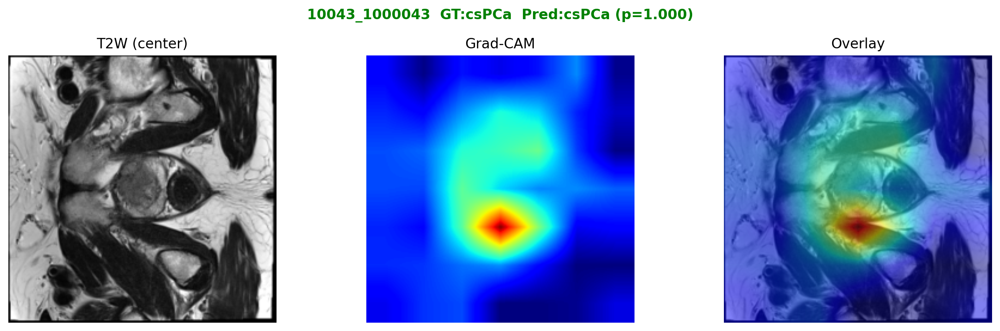

### Correctly predicted csPCa patients — `focal_deep` (TP cases: 9/10)

| Patient | Grad-CAM (T2W center · heatmap · overlay) |
|---------|------------------------------------------|
| `10043_1000043` |  |
| `10257_1000261` |  |
| `10398_1000404` |  |
| `10463_1000471` |  |
| `10486_1000494` |  |
| `10549_1000561` |  |
| `10558_1000570` |  |
| `10568_1000580` |  |
| `10589_1000603` |  |

> Patient `10539_1000549` was the single missed csPCa (FN) for `focal_deep`.

---

## 10. Discussion

### Why Weight Tiling works best

Weight tiling initializes the 96-channel conv by replicating pretrained RGB filter weights, so from the very first forward pass the backbone receives spatially coherent features resembling the RGB domain it was trained on. The 3×3 kernel retains its ability to capture local spatial patterns across the full multi-channel input. Fine-tuning then adjusts these weights to recognize prostate MRI-specific structures.

Crucially, the inflated conv introduces **no new parameters** — it simply repurposes existing pretrained knowledge. This is especially valuable with only 45 positive training examples.

### Why Channel Adapter struggles

The 1×1 adapter projects 96→3 channels in a purely channel-wise, spatially-blind manner. During early training it outputs near-random values, which the pretrained 3×3 conv processes as "corrupt RGB" — generating nonsense activations throughout the backbone. Large backbones (MedViT_base, 86M params) have enough capacity to gradually recover, but small backbones do not.

Even when stable, the adapter bottleneck inherently loses spatial cross-channel information that a 3×3 inflated conv would capture.

### Why Slice Transformer underperforms

The approach is theoretically elegant — each slice gets a full MedViT pass, and the Transformer captures inter-slice relationships. But in practice:

1. **Data scarcity**: The Transformer's attention matrices have `O(32² × d_model)` parameters, learned from scratch with 45 positive patients.
2. **Noisy gradients**: Per-patient processing at batch_size=1 yields single-sample gradient updates — very high variance.
3. **Overfitting pattern**: Val AUC peaked at 0.824 (epoch 40) then fell to 0.55, a classic overfitting signature. The model memorized training patients rather than generalizing.

Potential improvements: mean pooling (already in progress), 1-layer Transformer, higher dropout (≥0.3), or treating it as a multiple-instance learning problem.

### Clinical context

For prostate cancer screening, **sensitivity** (detecting true cancers) is paramount — a missed cancer has far greater consequences than an unnecessary biopsy.

**Recommended model**: `focal_deep` (Weight Tiling, MedViT_small, Focal Loss γ=2, head_depth=2)
- Test AUC = **0.919**
- Sensitivity = **0.90** (detects 9 of 10 cancers in test set)
- Specificity = 0.78 (22% false positive rate)

At the Youden-optimal threshold (0.77 for `focal_deep`), sensitivity drops to 0.70 but specificity rises to 0.93, offering a lower false positive burden for settings where radiologist review of flagged cases is resource-constrained.

---

## Appendix A: Directory Structure

```
ProstateCls/
├── dataset.py                          # Shared: PatientVolumeDataset, load_labels()
├── README.md                           # This file
├── weight_tiling/
│   ├── model.py                        # build_model(): inflated Conv(96→64)
│   ├── train.py                        # Training with 2-way differential LR
│   ├── visualize.py                    # Curves, ROC/PR (SVG+PNG), Grad-CAM
│   ├── 0_submit.sh                     # bash 0_submit.sh <name> [extra-args]
│   ├── 1_submit_vis.sh
│   ├── output/<run>/best.pth
│   └── figures/<run>/
│       ├── learning_curve.{png,svg}
│       ├── roc_pr_curve.{png,svg}
│       ├── confusion_matrix.png
│       ├── performance_table.txt
│       └── gradcam/gradcam_<patientID>.png
├── channel_adapter/
│   ├── model.py                        # ChannelAdaptedConv: Conv(96→3,1×1) + pretrained Conv(3→64)
│   ├── train.py                        # 3-way differential LR: backbone / adapter / head
│   └── 0_submit.sh                     # Default: backbone=base, lr_adapter=1e-4
└── slice_transformer/
    ├── model.py                        # SliceTransformerModel: per-slice MedViT + Transformer
    ├── train.py                        # ReduceLROnPlateau + patience reset on LR drop
    └── 0_submit.sh                     # Default: bs=1, pooling=cls
```

## Appendix B: Reproducing Experiments

```bash
cd ProstateCls/

# Weight Tiling — best runs
cd weight_tiling
bash 0_submit.sh focal_deep "--focal-gamma 2.0 --head-depth 2"
bash 0_submit.sh base_ce    "--backbone base"
bash 1_submit_vis.sh focal_deep
bash 1_submit_vis.sh base_ce

# Channel Adapter — best run
cd ../channel_adapter
bash 0_submit.sh adapter_base   # default: backbone=base, lr_adapter=1e-4
bash 1_submit_vis.sh adapter_base

# Slice Transformer
cd ../slice_transformer
bash 0_submit.sh slice_tf_small             # CLS pooling, bs=1
bash 0_submit.sh slice_tf_mean "--pooling mean"
bash 1_submit_vis.sh slice_tf_small
```

**Python interpreter**: `/N/slate/ohjiye/envs/medvit/bin/python3`
