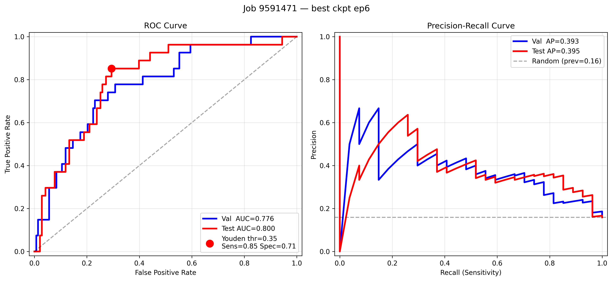
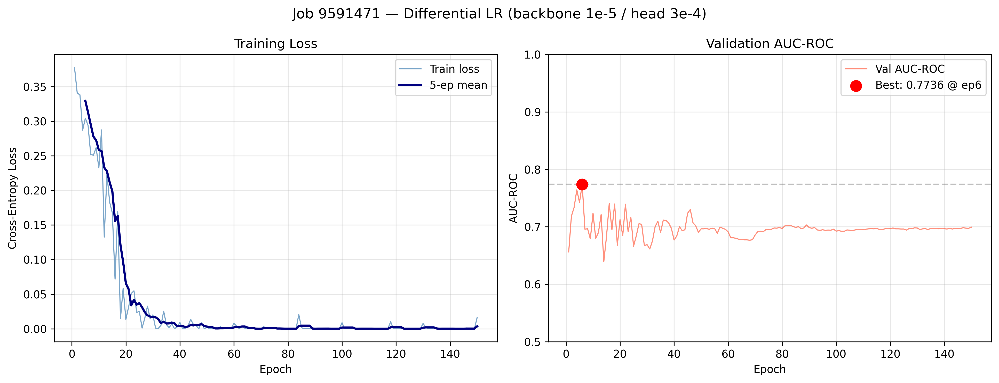
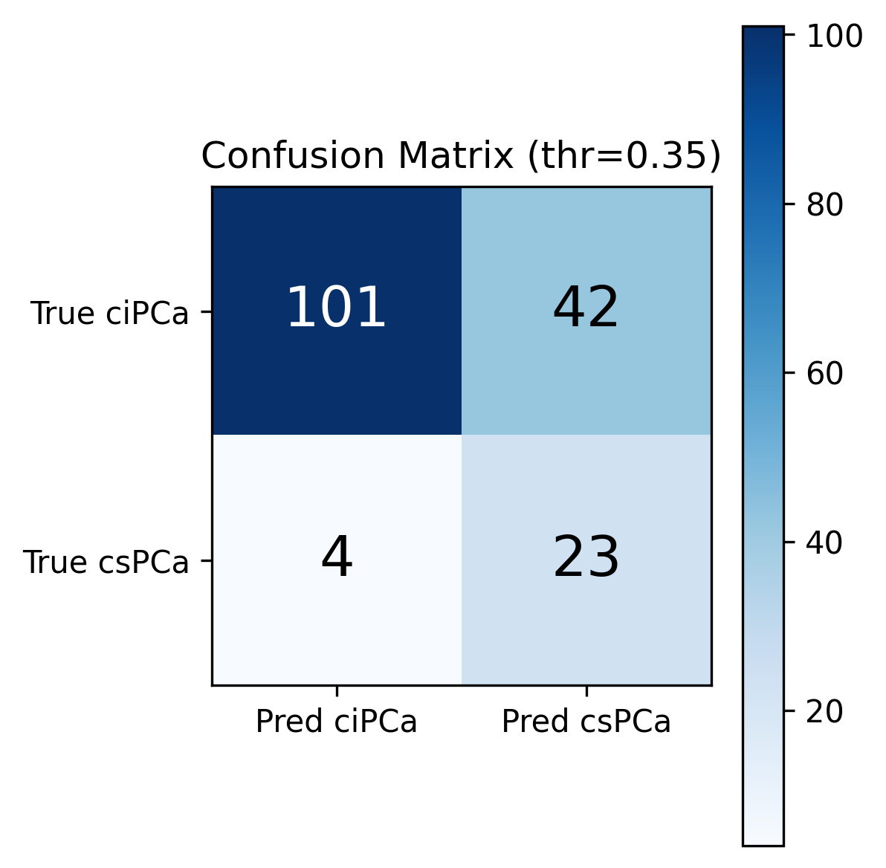

# PI-CAI Prostate Cancer Classification

Binary classification of prostate MRI studies into **csPCa** (clinically significant) vs **ciPCa** (clinically insignificant) prostate cancer, using the [PI-CAI dataset](https://pi-cai.grand-challenge.org/).

---

## Dataset

| | |
|---|---|
| Data root | `/N/slate/ohjiye/PI-CAI/PI-CAI_reg_processed_filtered/` |
| Label CSV | `/N/slate/ohjiye/PI-CAI/PI-CAI_reg_processed_filtered.csv` |
| MedViT weights | `/N/slate/ohjiye/medvit_ckpt/MedViT_small.pth` |
| Python env | `/N/slate/ohjiye/envs/medvit/bin/python3` |

**Modalities per patient:** T2W MRI · ADC map · Gland mask

**Label distribution (total 1,131 patients):**

| Split | Total | csPCa (1) | ciPCa (0) |
|-------|------:|----------:|----------:|
| Train | 791   | 125 (15.8%) | 666 (84.2%) |
| Val   | 170   | 27  | 143 |
| Test  | 170   | 27  | 143 |

Stratified split, `seed=42`.

---

## Input Representation

All methods except MIL use **Depth-as-Channel**: 32 slices × 3 modalities (T2W, ADC, gland) = **96 channels**, shape `[B, 96, 224, 224]`.

Channel order is slice-interleaved: `[T2W₀, ADC₀, gland₀, T2W₁, ADC₁, gland₁, …]`.

The MedViT first conv is inflated from 3→96 channels by tiling pretrained weights (`weight / 32`). All other backbone weights are loaded from the ImageNet pretrained checkpoint.

---

## Methods

### 1. Weight Tiling (`weight_tiling/`)

Baseline depth-as-channel approach. MedViT_small backbone with a 3-layer MLP classification head. Weight tiling inflates the first conv layer. Differential LR: backbone `1e-5`, head+stem `3e-4`.

Key variants:
- `wt_fbn` — default (freeze BN, CE loss)
- `wt_fbn_cos` — cosine LR schedule
- `wt_fbn_fbal` — freeze BN + BalancedBatchSampler (50/50 per batch)
- `wt_aug` — strong augmentation (hflip, intensity, rotation)
- `wt_cw6` — csPCa class weight ×6
- `wt_cw6_aug` — cw6 + augmentation
- `wt_os5` — csPCa oversample ×5 with per-epoch augmentation
- `wt_os5_cw4` — oversample ×5 + class weight ×4

### 2. Channel Adapter (`channel_adapter/`)

Adds a learnable channel adaptation module between the 96-channel inflated input and the MedViT backbone. The adapter learns an optimal linear mapping from 96 channels, allowing the backbone to process a more meaningful feature space.

Variant: `ca_os5` — oversample ×5 + augmentation

### 3. CNN Head (`cnn_head/`)

MedViT backbone + CBAM (Convolutional Block Attention Module) classification head. Channel attention (SE block) followed by spatial attention applied to backbone features before GAP and MLP classifier.

Key variants:
- `cnn_fbn_focal` — Focal loss (γ=2.0) to focus on hard csPCa cases
- `cnn_os5` — oversample ×5 + augmentation

### 4. Mask Guided (`mask_guided/`)

Gland mask is used as a soft spatial gate on the backbone features. The gland mask downsampled to 7×7 multiplies the deepest feature map `f4`, restricting attention to the prostate region before classification.

Variant: `mg_fbn_bal` — freeze BN + BalancedBatchSampler

### 5. Seg+Cls (`seg_cls/`)

Multi-task MedViT + U-Net decoder. Simultaneously predicts **tumor segmentation** (Dice+BCE loss within gland) and **csPCa classification**. The tumor prediction is used as a spatial gate on `f4` (without detach), so classification gradients flow through the decoder — forcing the model to learn where tumors are in order to classify correctly.

Architecture:
```
MedViT backbone (hooks at 4 stages)
  → U-Net decoder (f4→f3→f2→f1 skip connections) → tumor_pred [B,1,224,224]
  → f4 * gland_gate * (1 + tumor_gate)  ← tumor_pred gates classification features
  → CBAM → GAP + seg_proj(tumor_pred) → MLP → cls logits
```

Loss: `cls_loss + 0.5 × seg_loss`

Variants: `seg_fbn_focal`, `seg_fbn_fbal`, `seg_fbn_bal_d02`, `seg_fbn_focal_d02`, `seg_os5`

> ⚠️ Results pending — seg_cls rerun with improved tumor-gated model.

### 6. MIL-ABMIL (`mil_abmil/`)

Multiple Instance Learning with Gated Attention (ABMIL). Each patient study is treated as a bag of 32 slice instances. MedViT_small processes each slice independently (`[B×32, 3, 224, 224]`), then a Gated Attention pooling network aggregates slice-level features into a patient-level embedding for classification.

This is the only method that does NOT use 96-channel input — slices are processed separately, avoiding the DataParallel alignment issue.

```
MedViT(slice_i) → feat_i [1024]  (for i = 1..32)
GatedABMIL(feats) → attention weights + weighted sum → MLP → cls logits
```

Key variants:
- `baseline` — standard ABMIL
- `attn01` — attention regularization (λ=0.1) to spread attention across slices
- `mil_os5` — csPCa oversample ×5

---

## Results

Test set: 170 patients (csPCa=27, ciPCa=143). Metrics at thr=0.5 and Youden optimal threshold.

| Method | Run | Val AUC | **Test AUC** | Sens@0.5 | Spec@0.5 | TP | FN | Youden thr | Sens@Y | Spec@Y |
|--------|-----|--------:|------------:|---------:|---------:|---:|---:|----------:|-------:|-------:|
| weight_tiling | **wt_fbn_fbal** | 0.774 | **0.800** | 55.6% | 78.3% | 15 | 12 | 0.367 | 81.5% | 72.7% |
| channel_adapter | ca_os5 | 0.700 | **0.762** | 37.0% | 84.6% | 10 | 17 | 0.007 | 63.0% | 72.7% |
| mil_abmil | baseline | 0.792 | **0.759** | 92.6% | 42.0% | 25 | 2  | 0.876 | 74.1% | 65.7% |
| mil_abmil | attn01 | 0.854 | 0.743 | 18.5% | 93.0% | 5  | 22 | 0.000 | 70.4% | 58.0% |
| weight_tiling | wt_os5 | 0.798 | 0.729 | 70.4% | 65.0% | 19 | 8  | 0.824 | 55.6% | 72.7% |
| weight_tiling | wt_aug | 0.755 | 0.723 | 33.3% | 88.1% | 9  | 18 | 0.084 | 40.7% | 81.1% |
| weight_tiling | wt_cw6_aug | 0.797 | 0.720 | 29.6% | 88.1% | 8  | 19 | 0.001 | 77.8% | 65.0% |
| cnn_head | cnn_os5 | 0.807 | 0.717 | 33.3% | 81.1% | 9  | 18 | 0.004 | 74.1% | 65.0% |
| mil_abmil | mil_os5 | 0.778 | 0.713 | 92.6% | 48.2% | 25 | 2  | 0.982 | 55.6% | 70.6% |
| weight_tiling | wt_cw6 | 0.797 | 0.679 | 37.0% | 77.6% | 10 | 17 | 0.017 | 55.6% | 62.2% |
| cnn_head | cnn_fbn_focal | 0.814 | 0.739 | 40.7% | 86.7% | 11 | 16 | 0.024 | 63.0% | 74.1% |
| weight_tiling | wt_fbn | 0.848 | 0.734 | 37.0% | 92.3% | 10 | 17 | 0.000 | 44.4% | 82.5% |
| weight_tiling | wt_fbn_cos | 0.864 | 0.728 | 33.3% | 90.2% | 9  | 18 | 0.000 | 48.1% | 81.1% |
| mask_guided | mg_fbn_bal | 0.825 | 0.710 | 48.1% | 80.4% | 13 | 14 | 0.999 | 40.7% | 83.9% |
| weight_tiling | wt_os5_cw4 | 0.762 | 0.649 | 22.2% | 81.8% | 6  | 21 | 0.002 | 63.0% | 66.4% |
| mask_guided | mg_os5 | 0.734 | 0.603 | 14.8% | 87.4% | 4  | 23 | 0.000 | 40.7% | 65.7% |
| seg_cls | — | — | *pending* | — | — | — | — | — | — | — |

**Bold** = best per method. Test set: 27 csPCa, 143 ciPCa.

### Key observations

- **wt_fbn_fbal** achieves the best Test AUC (0.800) with BalancedBatch sampling — equal numbers of csPCa/ciPCa per batch.
- High Val AUC does not predict Test AUC (wt_fbn_cos: val 0.864 → test 0.728); the 15.8% minority class causes overfitting on val.
- **MIL baseline** achieves the highest sensitivity at thr=0.5 (92.6%, only 2 FN out of 27) at the cost of low specificity (42%).
- Youden threshold=0.000 in several runs indicates the model defaults to predicting positive for most patients — a sign of instability under class imbalance.
- **cs_oversample×5** + augmentation improves sensitivity (wt_os5: 70.4% vs wt_fbn: 37.0%) but trades off specificity.

---

## Visualizations

### Best model: `wt_fbn_fbal` (Test AUC 0.800)

| ROC & PR Curve | Learning Curve | Confusion Matrix |
|:-:|:-:|:-:|
|  |  |  |

### Grad-CAM: `wt_fbn_fbal` (True Positive cases)


### MIL Attention: `mil_baseline` (Test AUC 0.759)

| ROC & PR Curve | Slice Attention Map |
|:-:|:-:|
|  |  |

---

## Usage

```bash
cd /geode3/home/u070/ohjiye/Quartz/MedImage/ProstateCls

# Train (example: weight_tiling default)
cd weight_tiling
bash 0_submit.sh <run-name> [extra-args]
# e.g. bash 0_submit.sh wt_os5 "--cs-oversample 5 --aug-strong --hflip --intensity-aug"

# Visualize (after training completes)
bash 1_submit_vis.sh <run-name>
# → figures/<run-name>/ : roc_pr_curve.png, learning_curve.png, confusion_matrix.png, gradcam/
```

Common extra args:

| Flag | Description |
|------|-------------|
| `--cs-oversample N` | Repeat csPCa patients N× with different augmentation per epoch |
| `--cspca-weight W` | Override csPCa loss weight (default: inverse frequency) |
| `--aug-strong` | Random rotation + scale augmentation |
| `--hflip` | Random horizontal flip |
| `--intensity-aug` | Gaussian noise + brightness jitter |
| `--focal-gamma G` | Focal loss with γ=G (0 = CE loss) |
| `--balanced-batch` | Strict 50/50 csPCa/ciPCa per batch |
| `--backbone small\|base\|large` | MedViT backbone size |

---

## File Structure

```
ProstateCls/
├── dataset.py              # PatientVolumeDataset (shared)
├── weight_tiling/
│   ├── model.py            # MedViT + weight-tiled first conv + MLP head
│   ├── train.py
│   ├── visualize.py
│   ├── 0_submit.sh
│   └── 1_submit_vis.sh
├── channel_adapter/
│   ├── model.py            # MedViT + learnable channel adapter
│   └── ...
├── cnn_head/
│   ├── model.py            # MedViT + CBAM attention head
│   └── ...
├── mask_guided/
│   ├── dataset.py          # MaskGuidedDataset (includes gland mask)
│   ├── model.py            # MedViT + gland-gated features
│   └── ...
├── seg_cls/
│   ├── dataset.py          # SegClsDataset
│   ├── model.py            # MedViT + U-Net decoder + tumor-gated cls
│   └── ...
└── mil_abmil/
    ├── dataset.py          # MILDataset (per-slice bags)
    ├── model.py            # MedViT per-slice + GatedABMIL
    └── ...
```
