# ProstateCls — PI-CAI Prostate Cancer Classification

Binary classification of clinically significant prostate cancer (csPCa) from multi-parametric MRI using MedViT-based deep learning models.

---

## Task

| | |
|---|---|
| **Dataset** | PI-CAI (Prostate Imaging: Cancer AI) |
| **Task** | Patient-level binary classification: csPCa (ISUP ≥ 2) vs. ciPCa (ISUP 0–1 / benign) |
| **Modalities** | T2W · ADC (registered to T2W) · Gland mask |
| **Positive class** | csPCa = 1 &nbsp;&nbsp; Negative class = ciPCa = 0 |

---

## Dataset

| Split | Patients | csPCa | ciPCa | Positive rate |
|-------|----------|-------|-------|---------------|
| Train | 791 | 125 | 666 | 15.8% |
| Val   | 170 | 27  | 143 | 15.9% |
| Test  | 170 | 27  | 143 | 15.9% |
| **Total** | **1,131** | **179** | **952** | **15.8%** |

Single stratified split, `seed=42`. Patient-level (no slice leakage).

**Data root:** `/N/slate/ohjiye/PI-CAI/PI-CAI_reg_processed_filtered/`

Per patient:
```
<patientID>/
  <patientID>_t2w.nii.gz        # T2W MRI (3-D volume)
  <patientID>_adc_reg.nii.gz    # ADC map, registered to T2W space
  <patientID>_gland.nii.gz      # Prostate gland segmentation mask
  <patientID>_tumor.nii.gz      # Lesion mask (visualization only)
```

**Preprocessing (all methods):**
1. Resample T2W + ADC + gland in-plane to **0.5 mm/px** (bilinear; gland re-binarized)
2. Crop a fixed **80 mm FOV** centered on the gland centroid (XY)
3. Resize to **224 × 224**
4. Within-gland percentile normalization (p1–p99) separately for T2W and ADC
5. Select **32 axial slices** centered on the volume midpoint (or gland Z-centroid with `--gland-z-center`)

---

## Methods

Seven classification approaches are implemented, each as a self-contained sub-directory.

### 1. Weight Tiling (`weight_tiling/`)

**Input:** `[B, 96, 224, 224]` — 32 slices × 3 modalities interleaved channel-by-channel.

**Backbone:** MedViT_small pre-trained on ImageNet. First convolution inflated 3 → 96 channels by tiling pre-trained weights (÷ 32). All other layers frozen at pretrained values.

**Head:** MLP — `1024 → 512 → 256 → 2` (GELU, Dropout 0.2 each).

The simplest depth-as-channel baseline.

---

### 2. Channel Adapter (`channel_adapter/`)

Same depth-as-channel input as weight_tiling. Adds a learnable **channel attention adapter** before the backbone that recalibrates the 96-channel input across modalities and slices, then passes through the standard MedViT + MLP head.

Motivation: allow the model to learn which slice/modality combinations matter without relying on tiling initialization alone.

---

### 3. Mask-Guided (`mask_guided/`)

**Two-stream architecture:**
- **Image stream:** MedViT processes `[B, 96, 224, 224]` RGB+ADC+gland volume → `[B, 1024]`
- **Mask stream:** lightweight CNN on `[B, 32, 224, 224]` gland-only volume → `[B, 256]`
- **Fusion:** concatenate → `[B, 1280]` → MLP → 2

The mask branch provides explicit spatial context about the gland region, forcing the image stream to focus its attention on anatomically relevant voxels.

---

### 4. Mask BBox (`mask_bbox/`)

Instead of a fixed 80 mm FOV crop, crops a tight **bounding box around the gland** (with 20 mm margin), then resizes to 224 × 224. This produces variable-scale crops that tightly frame the prostate regardless of patient anatomy size.

Otherwise identical pipeline to mask_guided.

---

### 5. Slice Transformer (`slice_transformer/`)

Processes each of the 32 axial slices independently through a **shared** MedViT_small (3-channel: T2W, ADC, gland) → per-slice feature vectors `[B, 32, 1024]`. A lightweight **cross-slice transformer** (2 layers, 8 heads) aggregates slice-level features into a patient-level embedding → MLP → 2.

Captures inter-slice context without depth-as-channel inflation.

---

### 6. Slice Wise MIL (`slice_wise/`)

Same per-slice encoding as slice_transformer, but uses **Multiple Instance Learning (MIL)** with max-pooling aggregation: the patient-level score is the maximum csPCa logit across all 32 slices. No inter-slice attention.

Trains with `BCEWithLogitsLoss(pos_weight=n_neg/n_pos)`.

---

### 7. CNN Head (`cnn_head/`)

MedViT backbone is run up to its pre-pool stage, exposing a **`[B, 1024, 7, 7]` spatial feature map** instead of a flat vector. A CNN-based classification head processes the spatial structure directly:

| Variant | Head |
|---------|------|
| `cnn_se` | Squeeze-and-Excitation (channel) → GAP → FC |
| `cnn_cbam` | CBAM (SE + 7×7 spatial attention) → GAP → FC |
| `cnn_gem` | CBAM + Generalized Mean Pooling (learnable p) → FC |
| `cnn_ms` | Multi-scale DW conv (1×1/3×3/5×5/7×7, residual) + CBAM → GAP → FC |

At 7×7 spatial resolution the CNN head can attend to which quadrant of the FOV contains suspicious tissue, something a flat MLP cannot do.

---

## Results

Best test set result per method (threshold = 0.5, test n = 170, csPCa = 27):

| Method | Best Run | AUC-ROC | Sensitivity | Specificity | F1 |
|--------|----------|---------|-------------|-------------|-----|
| weight_tiling | `wt_warmup` | 0.8156 | 0.667 | 0.755 | 0.450 |
| channel_adapter | `adapter_lrbal` | 0.7674 | 0.815 | 0.706 | 0.484 |
| mask_guided | `mask_noflip` | **0.8427** ★ | **0.926** | 0.692 | **0.521** |
| mask_bbox | `bbox_cw_lo` | 0.7920 | 0.296 | **0.909** | 0.333 |
| slice_transformer | `slice_tf_warmup` | 0.7470 | 0.185 | 0.972 | 0.278 |
| slice_wise | `slice_wise_cosine` | 0.7700 | 0.778 | 0.629 | 0.416 |
| cnn_head | *(running)* | — | — | — | — |

★ **Overall best: `mask_guided / mask_noflip` — AUC 0.8427, Sensitivity 0.926** (25/27 csPCa detected)

**Key observations:**
- Mask-guided consistently outperforms pure depth-as-channel (weight_tiling) — the explicit gland mask stream helps localize relevant anatomy.
- High-weight csPCa variants (`_cw_hi`) boost sensitivity at the cost of specificity; inverse for `_cw_lo`.
- No-flip augmentation (`mask_noflip`) achieved the highest overall AUC — horizontal flip may introduce ambiguity in prostate anatomy orientation.
- Slice-wise aggregation methods are competitive without depth-as-channel inflation, but more sensitive to LR scheduling.

---

## Example: Successful Detection Cases

Best model: **`mask_guided / mask_noflip`** — 25 out of 27 csPCa patients correctly identified (TP=25, FN=2, FP=44, TN=99).

Grad-CAM overlays are generated per patient in `figures/<run>/gradcam/` (filename: `gradcam_<patientID>.png`).

### Learning Curve — mask_noflip
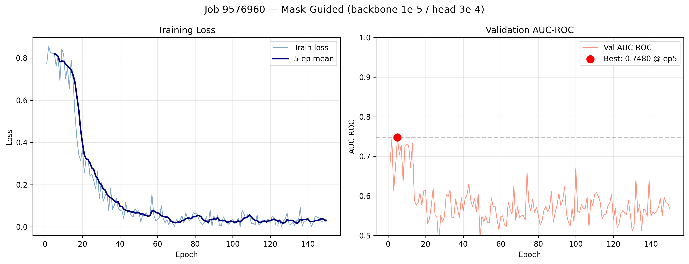

### ROC & PR Curves — mask_noflip
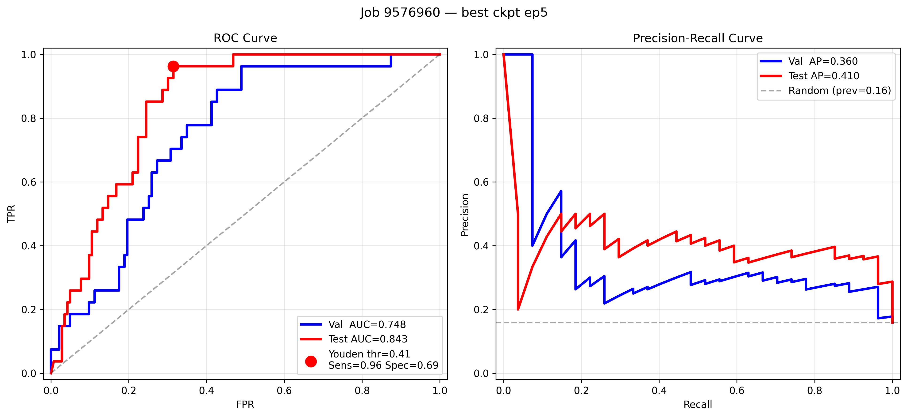

### Confusion Matrix — mask_noflip
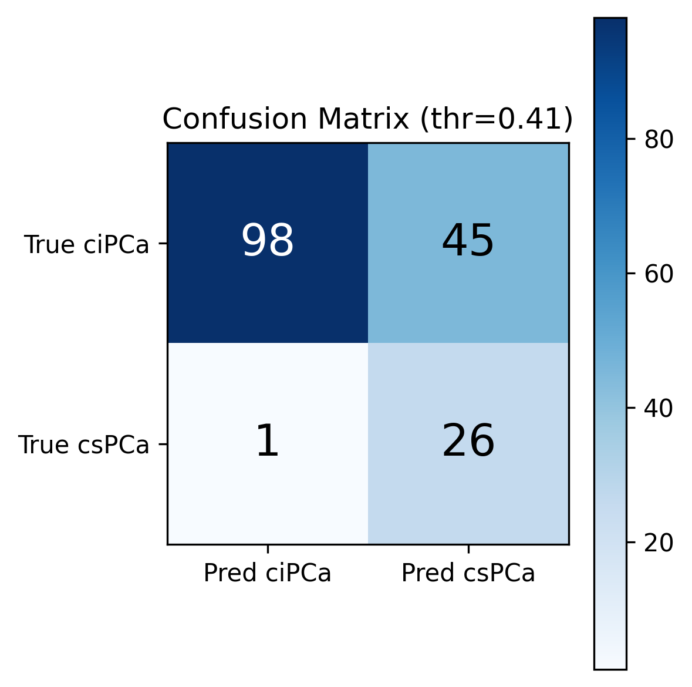

### Grad-CAM: Correctly Detected csPCa Cases (True Positives)

Grad-CAM activations highlight the peripheral zone where aggressive tumors appear as T2W hypointense regions with restricted diffusion (low ADC). All 27 test csPCa patients have overlays; 25 were correctly predicted positive.

| Patient 10005 | Patient 10019 | Patient 10085 |
|---------------|---------------|---------------|
| 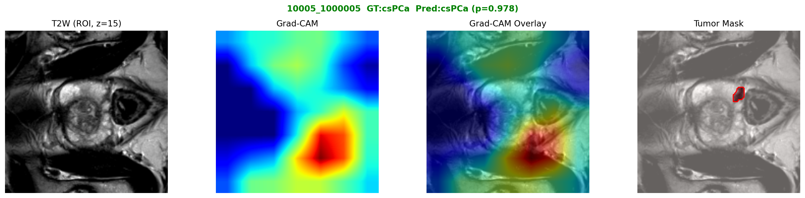 | 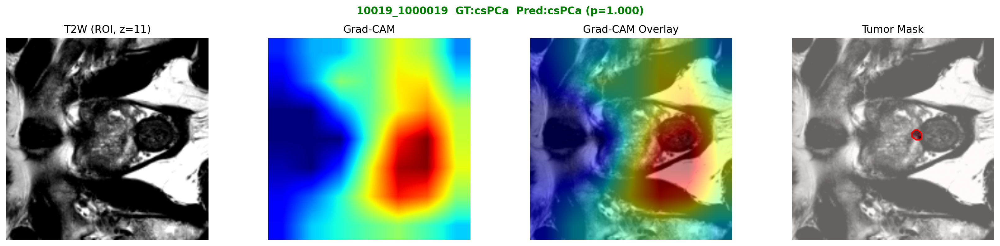 | 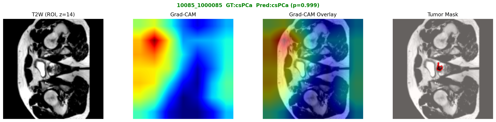 |

| Patient 10220 | Patient 10233 | Patient 10289 |
|---------------|---------------|---------------|
| 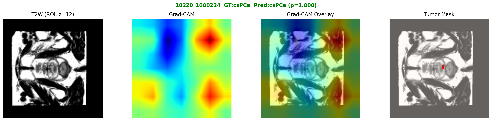 | 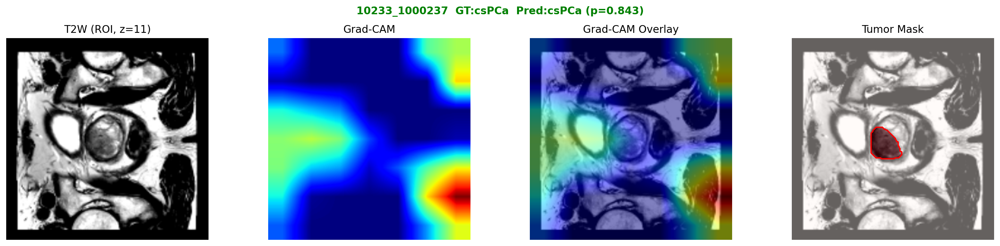 | 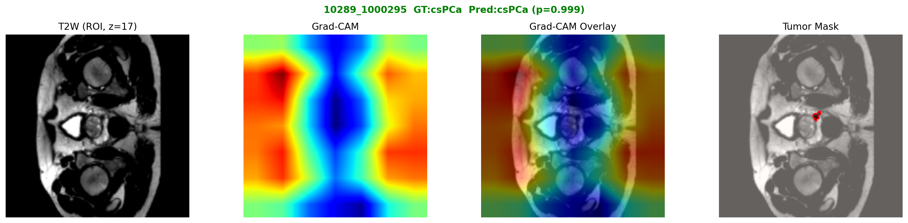 |

### weight_tiling best run (wt_warmup) — for comparison

| Learning curve | ROC/PR |
|----------------|--------|
| 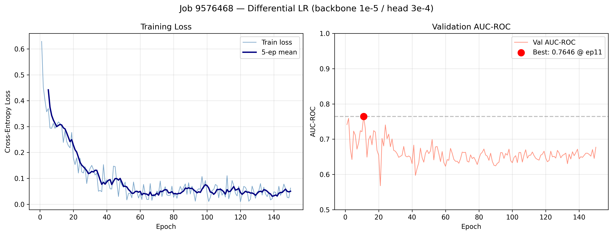 | 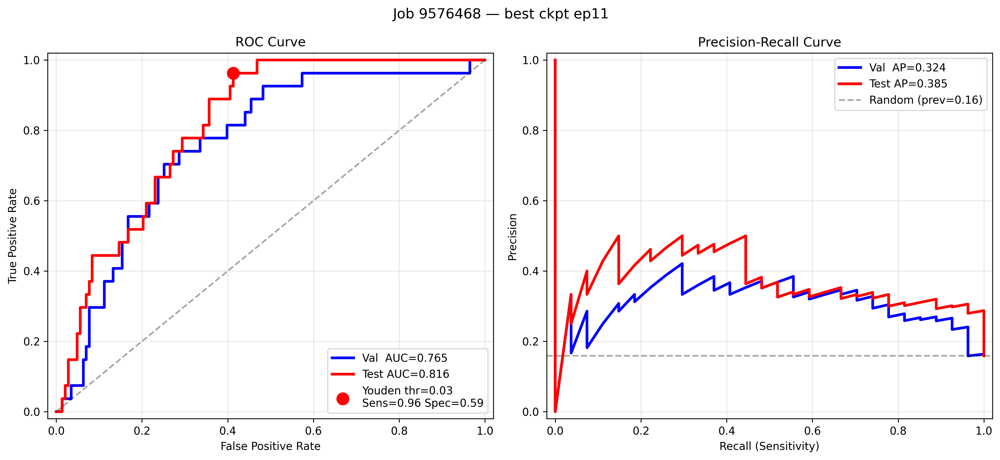 |

### mask_bbox best run (bbox_cw_lo)

| Learning curve | ROC/PR |
|----------------|--------|
| 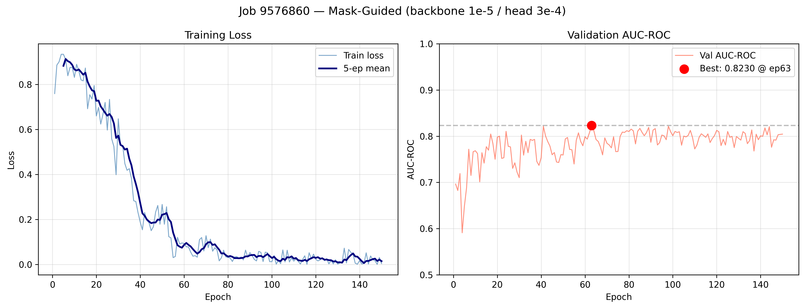 | 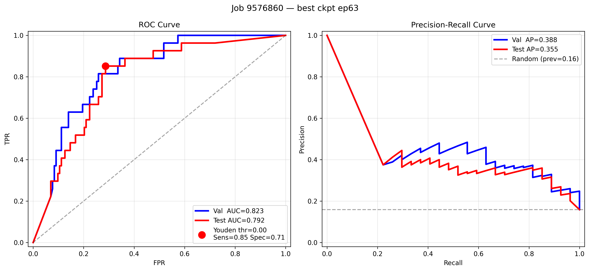 |

---

## Quickstart

**Environment:** `/N/slate/ohjiye/envs/medvit/bin/python3`

```bash
cd /geode3/home/u070/ohjiye/Quartz/MedImage/ProstateCls

# Train (any method)
bash weight_tiling/0_submit.sh   deeper_head
bash mask_guided/0_submit.sh     mask_noflip    "--no-hflip"
bash cnn_head/0_submit.sh        cnn_cbam       "--cnn-head cbam"

# Visualize a completed run
bash weight_tiling/1_submit_vis.sh   deeper_head
bash mask_guided/1_submit_vis.sh     mask_noflip

# Outputs per run:
#   logs/<run>/        — SLURM stdout/stderr
#   output/<run>/      — best.pth + config.json
#   figures/<run>/     — learning_curve.png, roc_pr_curve.png,
#                        confusion_matrix.png, gradcam/
```

**Augmentation flags (all methods):**

| Flag | Effect |
|------|--------|
| `--focal-gamma 2.0` | Switch to Focal Loss |
| `--scheduler cosine` | CosineAnnealingLR instead of ReduceLROnPlateau |
| `--backbone base` | MedViT_base (deeper backbone) |
| `--cspca-weight 5.0` | Override positive class weight |
| `--aug-t2w-only` | Intensity augmentation on T2W only (ADC spatial-only) |
| `--no-hflip` | Disable horizontal flip augmentation |
| `--gland-z-center` | Center 32-slice window on gland Z centroid |
| `--freeze-epochs 10` | Freeze backbone for first N epochs then unfreeze |

---

## Training Details

| Hyperparameter | Value |
|---------------|-------|
| Optimizer | AdamW |
| Backbone LR | 1e-5 (pretrained params) |
| Head / new-layer LR | 3e-4 |
| Weight decay | 1e-4 |
| Scheduler | ReduceLROnPlateau (factor=0.5, patience=10) |
| Max epochs | 150 |
| Early stopping | patience=30 (val AUC) |
| Batch size | 8 |
| Grad clip | max_norm=1.0 |
| Class weights | auto inverse-frequency (ciPCa ≈ 0.59, csPCa ≈ 3.16) |
| Sampler | WeightedRandomSampler (class-balanced oversampling) |
| Input size | 224 × 224 |
| Slices per patient | 32 |

**Differential LR** keeps backbone BatchNorm running stats stable (lr=1e-5) while allowing fast convergence for newly initialized layers — inflated first conv and classification head (lr=3e-4).

---

## Architecture: MedViT Backbone

MedViT ([Nejati et al., 2023](https://arxiv.org/abs/2302.09462)) is a hierarchical CNN-Transformer hybrid:

```
Input [B, 96, 224, 224]
  │
  ├─ Stem (4× ConvBNReLU, stride 2+2)   → [B, 64, 56, 56]
  │
  ├─ Stage 1 (3× ECB, stride 1)          → [B,  96, 56, 56]
  ├─ Stage 2 (4× ECB+LTB, stride 2)      → [B, 256, 28, 28]
  ├─ Stage 3 (10× ECB+LTB, stride 2)     → [B, 512, 14, 14]
  └─ Stage 4 (3× ECB+LTB, stride 2)      → [B, 1024, 7, 7]
       │
       ├─ [weight_tiling / channel_adapter / mask_guided / mask_bbox / slice_wise]
       │    AdaptiveAvgPool(1,1) → flatten → [B, 1024]
       │    MLP: 1024 → 512 → 256 → 2
       │
       └─ [cnn_head]
            CNN attention head (SE / CBAM / GeM / MS) → [B, 2]
```

**Weight inflation** (depth-as-channel): the pretrained 3-channel first conv weight `[64, 3, 3, 3]` is tiled to `[64, 96, 3, 3]` and divided by 32, preserving pre-activation magnitude.

---

## File Structure

```
ProstateCls/
├── dataset.py                  # Shared: PatientVolumeDataset, augmentation, FOV crop
├── eval_threshold.py           # Sweep decision threshold across completed runs
├── eval_submit.sh              # Threshold sweep SLURM launcher
│
├── weight_tiling/
│   ├── model.py                # build_model(): MedViT + MLP head
│   ├── train.py                # Training + evaluation loop
│   ├── visualize.py            # Learning curve, ROC/PR, Grad-CAM
│   ├── 0_submit.sh             # SLURM train launcher
│   ├── 1_submit_vis.sh         # SLURM viz launcher
│   ├── logs/<run>/             # SLURM stdout/stderr
│   ├── output/<run>/           # best.pth, config.json
│   └── figures/<run>/          # PNG outputs + gradcam/
│
├── channel_adapter/            # Same structure
├── mask_guided/                # + mask_branch in model.py, MaskGuidedDataset
├── mask_bbox/                  # + adaptive gland bbox crop in dataset.py
├── slice_transformer/          # + SliceTransformerModel, cross-slice attention
├── slice_wise/                 # + SliceWiseDataset, MIL max-pool aggregation
└── cnn_head/                   # + ProstateCNNModel, SE/CBAM/GeM/MS spatial heads
    ├── model.py
    ├── train.py
    └── 0_submit.sh
```

---

## References

- **MedViT:** Nejati O. et al., *MedViT: A Robust Vision Transformer for Generalized Medical Image Classification*, CVPR 2023. [arXiv:2302.09462](https://arxiv.org/abs/2302.09462)
- **PI-CAI:** Saha A. et al., *Artificial Intelligence and Radiologists at Prostate Cancer Detection in MRI*, Radiology 2023. [DOI:10.1148/radiol.220029](https://doi.org/10.1148/radiol.220029)
- **CBAM:** Woo S. et al., *CBAM: Convolutional Block Attention Module*, ECCV 2018.
- **GeM Pooling:** Radenović F. et al., *Fine-Tuning CNN Image Retrieval with No Human Annotation*, TPAMI 2019.
