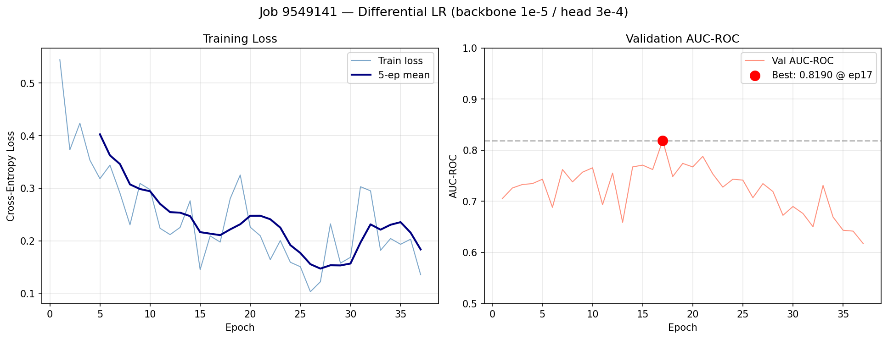
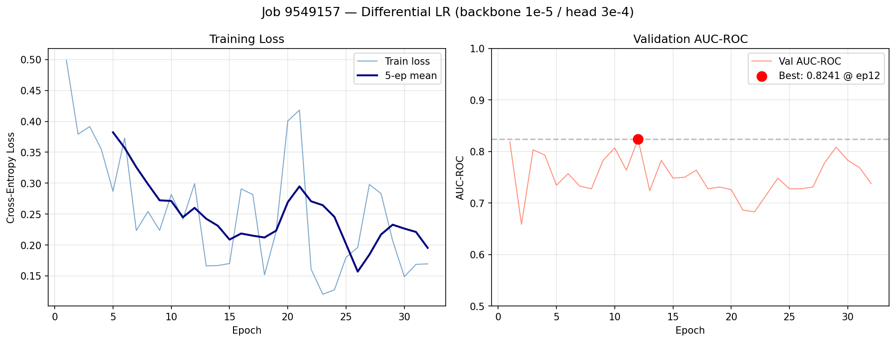
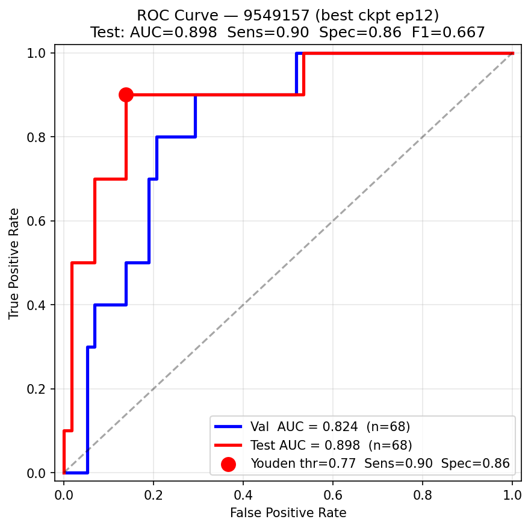
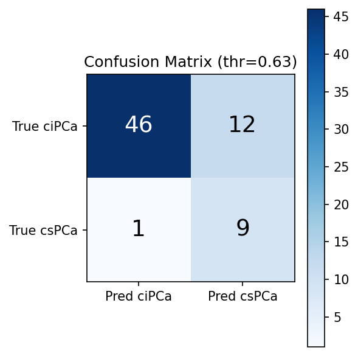
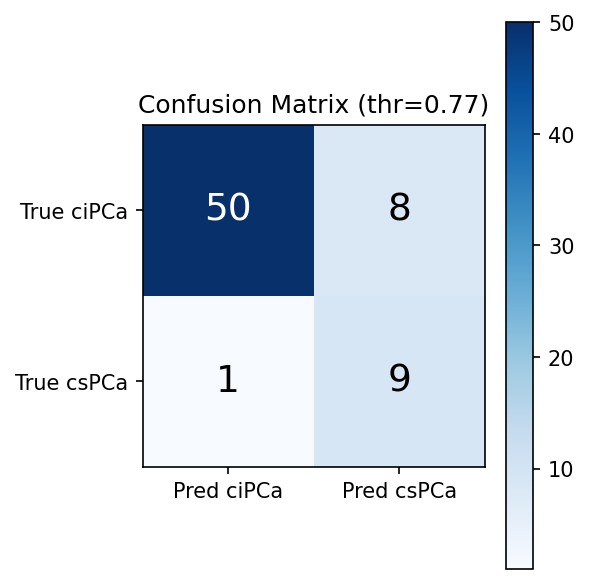
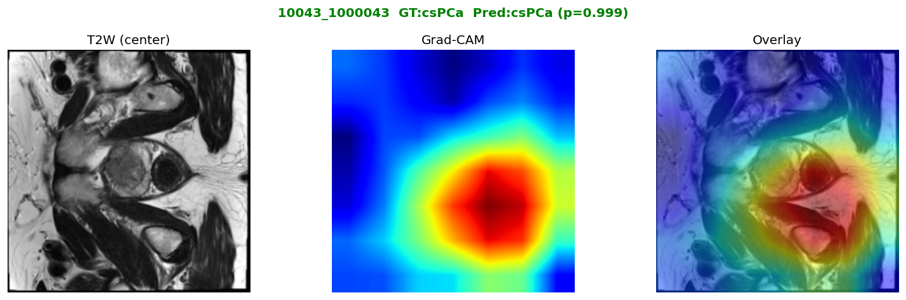
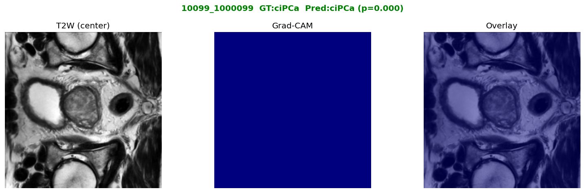

# PI-CAI Prostate Cancer Classification

Binary classification of prostate MRI studies using MedViT with depth-as-channel encoding.

| Class | Label | Patients | Ratio |
|-------|-------|----------|-------|
| **csPCa** — clinically significant | 1 | 65 | 14.4 % |
| **ciPCa** — clinically insignificant | 0 | 386 | 85.6 % |
| **Total** | | **451** | |

---

## Dataset

| Item | Path |
|------|------|
| Processed volumes | `/N/slate/ohjiye/PI-CAI/PI-CAI_reg_processed_filtered/` |
| Label CSV | `/N/slate/ohjiye/PI-CAI/PI-CAI_reg_processed_filtered.csv` |
| MedViT pretrained weights | `/N/slate/ohjiye/medvit_ckpt/MedViT_small.pth` |
| Virtual environment | `/N/slate/ohjiye/envs/medvit/bin/python3` |

> **Excluded patients** (4): `10188_1000191` (ADC CRC error), `10448_1000456`, `10559_1000571`, `10593_1000607` (extraction / T2W missing)

### Data structure

```
PI-CAI_reg_processed_filtered/<patientID>/
  <patientID>_t2w.nii.gz        # T2-weighted MRI (3D)
  <patientID>_adc_reg.nii.gz    # ADC map (co-registered to T2W)
  <patientID>_gland.nii.gz      # Prostate gland segmentation mask
  <patientID>_tumor.nii.gz      # Tumor mask (not used)
```

Normalization: per-volume 1–99th percentile clipping → [0, 1].

---

## Model Architecture

**MedViT_small** backbone with a **depth-as-channel** input strategy.

### Input encoding

All 32 axial slices × 3 modalities are stacked into a single 2-D tensor, enabling one patient = one forward pass:

```
[B, 96, 224, 224]   ←   32 slices × (T2W, ADC, gland mask)
Channel order (interleaved): [T2W₀, ADC₀, gland₀, T2W₁, ADC₁, gland₁, …, gland₃₁]
```

### Pretrained weight inflation

Only the first Conv layer is widened (3 ch → 96 ch); all other backbone weights are loaded from the ImageNet-pretrained checkpoint unchanged.

```
Pretrained:  [64,  3, 3, 3]
Inflated:    [64, 96, 3, 3]   ←  pretrained weight tiled 32×, then ÷ 32
```

Summing 96-channel responses at initialisation equals summing 3-channel responses → backbone behaviour is preserved.

### Classification head (`deeper_head`, current best)

```
MedViT backbone → [B, 1024]
  Linear(1024 → 512) → GELU → Dropout(0.2)
  Linear( 512 → 256) → GELU → Dropout(0.2)
  Linear( 256 →   2)
```

### Training settings

| Parameter | Value |
|-----------|-------|
| Optimizer | AdamW |
| Backbone LR | 1e-5 (slow — prevents BN drift) |
| Head LR | 3e-4 (fast — new layers) |
| Weight decay | 1e-4 |
| Scheduler | CosineAnnealingLR (T_max = 150, η_min = 1e-7) |
| Batch size | 8 patients |
| Loss | CrossEntropyLoss(weight = [0.583, 3.500]) — ciPCa : csPCa = 1 : 6 |
| Sampler | WeightedRandomSampler (class-balanced oversampling) |
| Gradient clipping | max_norm = 1.0 |
| Early stopping | patience = 20 epochs on val AUC |

### Data split (seed = 42, stratified)

| Split | Patients | csPCa | ciPCa |
|-------|----------|-------|-------|
| Train | 315 | 45 | 270 |
| Val | 68 | 10 | 58 |
| Test | 68 | 10 | 58 |

---

## Experiment Results

### Summary

| Run | Head | Val AUC (best ep) | Test AUC | Sensitivity | Specificity | F1 (csPCa) |
|-----|------|:-----------------:|:--------:|:-----------:|:-----------:|:----------:|
| baseline | 1024 → 256 → 2  (Dropout 0.4) | 0.8190 (ep 17 / 37) | 0.8983 | **0.9000** | 0.7586 | 0.546 |
| **deeper_head** | 1024 → 512 → 256 → 2  (Dropout 0.2) | 0.8241 (ep 12 / 32) | **0.8983** | **0.9000** | **0.8276** | **0.621** |

> Test set: 68 patients (10 csPCa, 58 ciPCa). Metrics at threshold = 0.5.  
> Both runs: lr_head = 3e-4, batch = 8, T_max = 150.

**Key takeaway**: The deeper head (3-layer MLP, Dropout 0.2) achieves the same AUC and sensitivity as the shallow baseline while reducing false positives from 14 → 10 (Specificity +7 pp, F1 +0.075). The single 1024 → 256 projection of the baseline creates an information bottleneck that hurts precision.

---

### Learning Curves

<table>
<tr>
<th>baseline</th>
<th>deeper_head</th>
</tr>
<tr>
<td></td>
<td></td>
</tr>
</table>

Both runs peak within the first 10–17 epochs and then degrade as the model overfits the small training set (315 patients, 45 csPCa). Early stopping at patience = 20 halts training before further degradation.

---

### ROC Curve



> Youden-optimal threshold (deeper_head): **0.77** → Sensitivity 0.80, Specificity 0.86.  
> At the default threshold 0.50 the model prioritises recall: Sensitivity 0.90, Specificity 0.83.

---

### Confusion Matrix

<table>
<tr>
<th>baseline  (thr = 0.5)</th>
<th>deeper_head  (thr = 0.5)</th>
</tr>
<tr>
<td></td>
<td></td>
</tr>
</table>

The deeper head reduces false positives (ciPCa → csPCa) from 14 to 10 while keeping the true positive count identical (9 / 10 csPCa detected).

---

### Grad-CAM Attention Maps

Grad-CAM applied to the last convolutional block of MedViT. Each row shows: **T2W slice (center)** · **Grad-CAM heatmap** · **overlay**.

#### Correct csPCa — patient `10043_1000043`  (P(csPCa) = 0.999)



The model attends strongly to the peripheral zone, consistent with the typical anatomical location of clinically significant prostate cancer.

#### Correct ciPCa — patient `10099_1000099`  (P(csPCa) = 0.000)



Uniformly low activation throughout the gland reflects the model's confident benign prediction.

---

### Per-threshold Performance (deeper_head, test set)

```
Threshold  Sensitivity  Specificity  Precision       F1   TP   FP   TN   FN
---------------------------------------------------------------------------
     0.20       0.9000       0.7931     0.4286   0.5806    9   12   46    1
     0.30       0.9000       0.8103     0.4500   0.6000    9   11   47    1
     0.40       0.9000       0.8103     0.4500   0.6000    9   11   47    1
     0.50       0.9000       0.8276     0.4737   0.6207    9   10   48    1
     0.60       0.9000       0.8448     0.5000   0.6429    9    9   49    1
     0.70       0.9000       0.8448     0.5000   0.6429    9    9   49    1
     0.77       0.8000       0.8621     0.5000   0.6154    8    8   50    2  ← Youden
```

---

## Ongoing Experiments

| Run | Change from deeper_head | Hypothesis |
|-----|------------------------|-----------|
| aug_strong | Stronger augmentation (rotation ±25°, translate ±12%, noise ↑, gamma 0.75–1.40) | Reduce early overfitting from limited data |
| pw5 | csPCa CrossEntropyLoss weight 3.5 → 5.0 | Increase recall / F1 by penalising false negatives more heavily |

---

## Pipeline

```bash
cd /geode3/home/u070/ohjiye/Quartz/MedImage/ProstateCls

# Train
bash 0_submit.sh <run-name>

# Train with experiment flags
bash 0_submit.sh aug_strong "--aug-strong"
bash 0_submit.sh pw5        "--cspca-weight 5.0"

# Visualise (auto-detects latest run if no arg given)
bash 1_submit_vis.sh <run-name>
```

### Outputs per run

| Path | Contents |
|------|---------|
| `logs/<name>/<jobid>.out` | SLURM stdout — epoch log, final test metrics |
| `output/<name>/best.pth` | Best checkpoint (val AUC) |
| `output/<name>/config.json` | Full experiment config: hyperparams, model structure, SLURM job ID |
| `figures/<name>/learning_curve.png` | Train loss + val AUC over epochs |
| `figures/<name>/roc_pr_curve.png` | ROC + Precision-Recall curves (val & test) |
| `figures/<name>/confusion_matrix.png` | Confusion matrix at threshold 0.5 |
| `figures/<name>/performance_table.txt` | Multi-threshold metrics + per-patient predictions |
| `figures/<name>/gradcam/` | Grad-CAM overlays for all test patients |

---

## Code Structure

| File | Description |
|------|-------------|
| `ProstateCls/dataset.py` | `PatientVolumeDataset`: load → normalise → stack → `[96, 224, 224]`. Standard and strong augmentation modes. |
| `ProstateCls/model.py` | `build_model()`: weight-inflated MedViT_small + 3-layer MLP head |
| `ProstateCls/train.py` | Differential LR training, weighted sampling, early stopping, config save |
| `ProstateCls/visualize.py` | Learning curve, ROC+PR curve, confusion matrix, Grad-CAM |
| `ProstateCls/0_submit.sh` | SLURM launcher — `bash 0_submit.sh <name> [extra-args]` |
| `ProstateCls/1_submit_vis.sh` | Visualisation launcher |

---

## Environment

- **HPC**: IU Quartz, partition `gpu` (V100), account `r02144`
- **Python env**: `/N/slate/ohjiye/envs/medvit/bin/python3`
- **Key packages**: PyTorch, nibabel, scikit-learn, timm, einops

```bash
squeue -u $USER      # check running jobs
scancel <jobid>      # cancel a job
```
