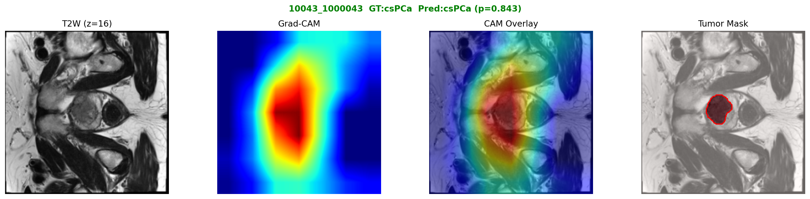
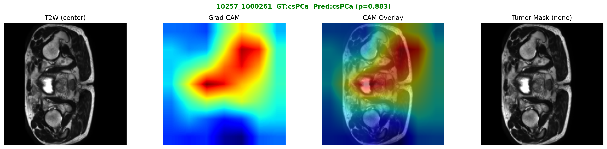
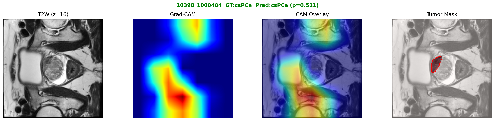
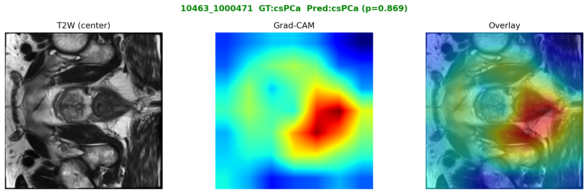
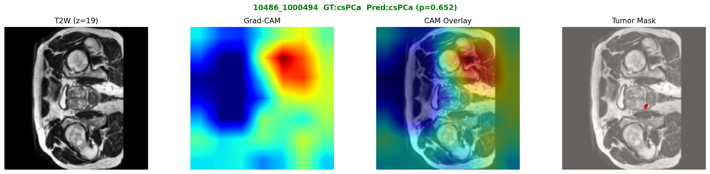
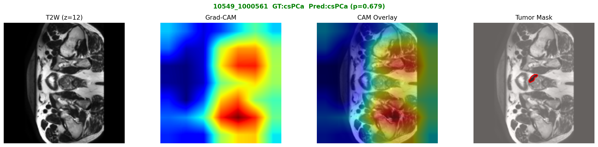
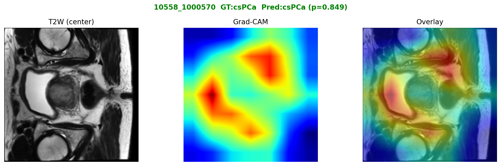
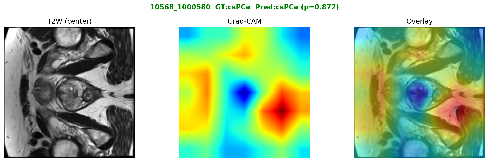
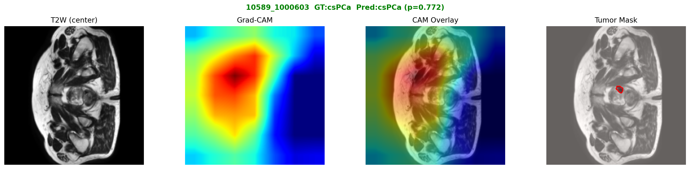
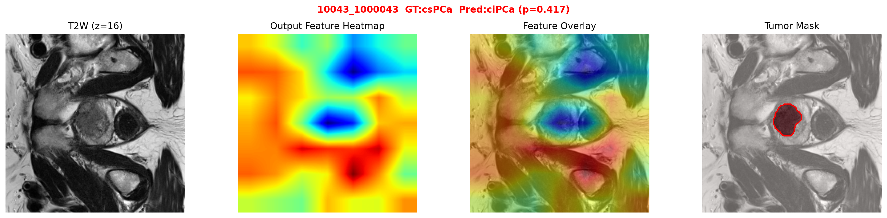

## Prostate Cancer Classification with MedViT: Handling Multi-Modal 3D MRI Input

---

### 1. Problem Statement

The task is binary classification of prostate MRI patient studies into **clinically significant prostate cancer (csPCa)** and **clinically insignificant prostate cancer (ciPCa)**, using T2-weighted MRI (T2W), apparent diffusion coefficient maps (ADC), and prostate gland segmentation masks.

Two fundamental challenges arise when applying a pretrained Vision Transformer (MedViT) to this setting:

**Challenge 1 — Severe class imbalance.** Clinically significant cancer is rare relative to the total patient population. A naive classifier can achieve high accuracy simply by predicting all patients as ciPCa, making standard accuracy an unreliable metric. In clinical practice, missing a true cancer (false negative) carries a far greater cost than an unnecessary follow-up (false positive), so the model must be explicitly pushed toward high sensitivity.

**Challenge 2 — Input channel mismatch.** MedViT is pretrained on natural images and expects a standard 3-channel RGB input (`[B, 3, H, W]`). Each prostate MRI study, however, consists of 32 axial slices across 3 modalities, yielding 96 channels when stacked as a single 2D tensor. There is no straightforward way to use the pretrained weights without modification. Three fundamentally different strategies were explored for bridging this mismatch.

---

### 2. Dataset

#### Source and Scope

The PI-CAI (Prostate Imaging: Cancer AI) dataset provides multi-parametric prostate MRI studies with pathology-confirmed labels. The full dataset contains approximately 1,000 patient studies. After filtering for complete data (T2W, ADC, and gland mask all available) and removing studies with known acquisition or registration errors, **451 patients** were retained for this work.

#### Class Distribution

| Class | Label | Count | Proportion |
|-------|-------|-------|-----------|
| csPCa (clinically significant) | 1 | 65 | 14.4% |
| ciPCa (clinically insignificant) | 0 | 386 | 85.6% |
| **Total** | | **451** | |

The positive class (csPCa) makes up only **1 in 7 patients**, creating a 1:6 class imbalance. A classifier that always predicts ciPCa would achieve 85.6% accuracy while detecting zero cancers.

#### Data Split

A single stratified split (seed=42) was applied at the patient level, ensuring no patient appears in more than one split and that the csPCa prevalence is preserved across all three sets.

| Split | Patients | csPCa | ciPCa |
|-------|----------|-------|-------|
| Train | 315 | 45 (14.3%) | 270 |
| Val   | 68  | 10 (14.7%) | 58  |
| Test  | 68  | 10 (14.7%) | 58  |

#### Input Representation

Each patient study is represented as a single 2D tensor by interleaving all 32 axial slices across 3 modalities:

```
[T2W₀, ADC₀, gland₀,  T2W₁, ADC₁, gland₁,  ...,  T2W₃₁, ADC₃₁, gland₃₁]
→ shape: [B, 96, 224, 224]
```

This *depth-as-channel* encoding enables a single 2D forward pass per patient, avoiding the computational overhead of 3D convolutions or recurrent processing.

---

### 3. Methods

#### 3.1 Addressing Class Imbalance

All three model variants use the same set of strategies to counter the 1:6 class imbalance:

**Weighted loss function.** Cross-entropy loss is weighted inversely proportional to class frequency:

```
weight[c] = N / (2 × count[c])  →  ciPCa: 0.583,  csPCa: 3.500
```

csPCa samples thus contribute 6× more to the loss than ciPCa samples. A variant using **Focal Loss** (γ=2) was also tested; focal loss additionally down-weights easy negatives (confident ciPCa predictions), focusing training capacity on ambiguous cases near the decision boundary.

**Oversampling.** A `WeightedRandomSampler` is used during training so that each mini-batch contains approximately equal numbers of csPCa and ciPCa patients, regardless of their true ratio in the dataset.

**Evaluation.** AUC-ROC (threshold-independent) is used as the primary validation metric for model selection. Sensitivity, specificity, and F1 score are reported on the test set.

---

#### 3.2 Addressing Input Channel Mismatch

The core technical challenge: MedViT's first convolutional layer has the form `Conv2d(3, 64, kernel_size=3)` and carries pretrained weights shaped `[64, 3, 3, 3]`. The prostate MRI input has 96 channels, not 3. Three distinct strategies were compared.

---

##### Method 1 · Weight Tiling

**Concept.** The pretrained 3-channel conv weights are *tiled* 32 times along the channel dimension to construct a new 96-channel conv. Dividing by 32 ensures that summing over 96 channels at initialization is equivalent to summing over the original 3 channels, preserving the pretrained backbone's initial behavior.

```
Pretrained:  weight [64,  3, 3, 3]
Tiled:       weight [64, 96, 3, 3]  =  repeat 32×, then ÷ 32

[B, 96, 224, 224]
    ↓  Conv(96→64, 3×3)   ← tiled from pretrained, fine-tuned
    ↓  MedViT backbone    ← pretrained, all layers
[B, 1024] → MLP head → [B, 2]
```

**Key properties.** The 3×3 spatial kernel is retained, allowing the model to capture local spatial relationships *across channels* from the first training step. No new parameters are introduced — only the existing pretrained weights are redistributed. The inflated conv is fine-tuned at a higher learning rate (3e-4) while the rest of the backbone is fine-tuned slowly (1e-5) to preserve pretrained features.

---

##### Method 2 · Channel Adapter

**Concept.** Rather than modifying pretrained weights, a small learnable module — a `1×1 Conv(96→3)` — is inserted *before* the original first conv, which is left completely unchanged.

```
[B, 96, 224, 224]
    ↓  Conv(96→3, 1×1)    ← randomly initialized adapter, lr=1e-4
    ↓  Conv(3→64, 3×3)    ← pretrained, untouched, lr=1e-5
    ↓  MedViT backbone    ← pretrained, lr=1e-5
[B, 1024] → MLP head → [B, 2]
```

The adapter learns to compress 96 channels into 3, producing a pseudo-RGB representation that the pretrained first conv can process exactly as during pretraining. Three separate learning rate groups are used: the backbone is frozen-near (1e-5), the adapter learns at a moderate rate (1e-4), and the new classification head is trained fast (3e-4).

**Key properties.** The pretrained first conv is fully preserved. However, a 1×1 convolution is spatially blind — it mixes channels without any spatial context. This is fundamentally weaker than the 3×3 tiled conv at capturing cross-channel spatial structure.

> In practice, MedViT_small collapsed when combined with the adapter — the randomly initialized adapter produced noisy activations that destabilized the small backbone's batch normalization statistics. MedViT_base (86M vs 29M parameters) proved robust.

---

##### Method 3 · Slice Transformer

**Concept.** Each of the 32 axial slices is treated as an independent 3-channel image and processed separately through the pretrained MedViT backbone. The 32 resulting feature vectors are then aggregated by a lightweight Transformer encoder, which models inter-slice relationships to produce a patient-level prediction.

```
[B, 96, 224, 224]
    ↓  reshape → [B, 32, 3, 224, 224]
    ↓  MedViT (shared weights, pretrained, lr=1e-5)    ← processed per-patient to avoid OOM
[B, 32, 1024]
    ↓  prepend CLS token + positional embedding
    ↓  Transformer Encoder (2 layers, 8 heads, ff=2048)    ← lr=3e-4
    ↓  CLS token output
[B, 1024] → MLP head → [B, 2]
```

**Key properties.** The pretrained first conv is used exactly as designed — no modification whatsoever. The Transformer can, in principle, learn that a lesion appearing in slice 14 is more significant when accompanied by a specific texture change in slice 18. However, the Transformer encoder introduces approximately 6 million new parameters that must be learned entirely from scratch. With only 45 positive training patients, this creates a significant risk of overfitting.

> **Memory constraint**: Processing `B×32=128` images simultaneously through MedViT exhausted GPU memory (>31 GB) at batch size 4. This was resolved by processing slices one patient at a time (peak memory = 32 images regardless of batch size), limiting practical batch size to 1–2.

---

#### 3.3 Shared Training Configuration

| Setting | Value |
|---------|-------|
| Optimizer | AdamW, weight_decay=1e-4 |
| LR scheduler | ReduceLROnPlateau (factor=0.5, patience=10 epochs) |
| Early stopping | patience=30, resets after each LR reduction |
| Gradient clipping | max_norm=1.0 |
| Max epochs | 150 |

**ReduceLROnPlateau** was chosen over the commonly used cosine annealing schedule after observing that cosine annealing decays the learning rate on a fixed schedule regardless of whether the model is still improving. When training plateaued early (e.g., best AUC at epoch 10 out of 150), cosine annealing continued to reduce the LR before the model had a chance to escape the plateau. With ReduceLROnPlateau, the LR is only reduced when val AUC has not improved for 10 consecutive epochs, and early stopping patience resets after each LR drop — giving the model another 30 epochs to improve at the new LR.

---

### 4. Results

Test set: 68 patients (10 csPCa, 58 ciPCa). Metrics reported at threshold=0.5.

| Method | Configuration | Test AUC | Sensitivity | Specificity | F1 (csPCa) | TP | FP | TN | FN |
|--------|--------------|:---:|:---:|:---:|:---:|:---:|:---:|:---:|:---:|
| Weight Tiling | `focal_deep` (Focal Loss, head×2) | **0.919** | **0.90** | 0.78 | 0.563 | 9 | 13 | 45 | 1 |
| Weight Tiling | `base_ce` (CE, MedViT-Base) | 0.907 | 0.80 | **0.90** | **0.667** | 8 | 6 | 52 | 2 |
| Weight Tiling | `deeper_head` (CE, head×2) | 0.898 | 0.90 | 0.83 | 0.621 | 9 | 10 | 48 | 1 |
| Weight Tiling | `baseline` (CE, head×1) | 0.898 | 0.90 | 0.76 | 0.545 | 9 | 14 | 44 | 1 |
| Weight Tiling | `focal_base` (Focal Loss, MedViT-Base) | 0.822 | 0.80 | 0.83 | 0.571 | 8 | 10 | 48 | 2 |
| Channel Adapter | `adapter_base` (CE, MedViT-Base) | 0.881 | 0.80 | 0.84 | 0.593 | 8 | 9 | 49 | 2 |
| Slice Transformer | `slice_tf_small` (CE, CLS pooling) | 0.764 | 0.20 | 0.95 | 0.267 | 2 | 3 | 55 | 8 |

#### Grad-CAM Attention Maps

Grad-CAM backpropagates the gradient of the csPCa prediction score through the final MedViT feature map, highlighting which spatial regions most influenced the decision. Each panel shows the T2W center slice, the Grad-CAM heatmap, and their overlay (red = high activation). All maps are from **test set** true positive patients.

**Weight Tiling (`focal_deep`) — 9 correctly detected csPCa patients**

| Patient | Attention Map |
|---------|--------------|
| 10043_1000043 |  |
| 10257_1000261 |  |
| 10398_1000404 |  |
| 10463_1000471 |  |
| 10486_1000494 |  |
| 10549_1000561 |  |
| 10558_1000570 |  |
| 10568_1000580 |  |
| 10589_1000603 |  |

**Method comparison — same patient (10043_1000043), correctly detected by both**

| Method | Attention Map |
|--------|--------------|
| Weight Tiling (`focal_deep`) |  |
| Channel Adapter (`adapter_base`) |  |

---

### 5. Discussion

#### Weight Tiling is the most effective strategy

All Weight Tiling variants achieve test AUC ≥ 0.82, with `focal_deep` reaching 0.919. The key advantage is that the 3×3 spatial kernel — even after inflation — can learn cross-channel spatial relationships from the very first gradient update, with pretrained spatial feature detectors providing a useful initialization. Importantly, no new parameters are introduced: the modification is entirely in how existing pretrained weights are reused.

The combination of Focal Loss and a two-layer MLP head (`focal_deep`) produced the highest AUC and sensitivity (0.90 — detecting 9 of 10 cancers), which is clinically most important. The `base_ce` variant (larger backbone, standard CE loss) missed 2 cancers but produced fewer false positives (6 vs 13), yielding the best F1 score. These represent different operating points along the sensitivity-specificity trade-off.

#### Channel Adapter is viable but constrained

The adapter approach achieves a competitive AUC of 0.881, but required the larger MedViT-Base backbone for stable training. The fundamental limitation is that a 1×1 convolution operates channel-wise without spatial context, making it intrinsically weaker than a 3×3 kernel at extracting spatial features across modalities. Additionally, the randomly initialized adapter generates noisy activations in early training, which small backbones cannot absorb — only the larger backbone's capacity allowed stable convergence.

A deeper two-layer adapter (96→32→3) was also tested but performed worse: the additional parameters added more noise without improving the quality of the learned projection, suggesting that the bottleneck itself (not its depth) is the binding constraint.

#### Slice Transformer overfits under data scarcity

The Slice Transformer is architecturally the most principled approach: each slice is processed by the full pretrained backbone, and a Transformer captures inter-slice dependencies. In a data-rich setting this would likely outperform the other two methods. However, with only 45 positive training patients, the ~6M Transformer parameters cannot be reliably learned. Validation AUC peaked at 0.824 (epoch 40) but test AUC was only 0.764, with sensitivity collapsing to 0.20 — a clear sign of overfitting to training patients rather than learning generalizable features.

#### Class imbalance remains the dominant challenge

Across all approaches, sensitivity is consistently more difficult to achieve than specificity. Even the best model (`focal_deep`) generates 13 false positives while missing only 1 true cancer. The small absolute number of csPCa patients in training (45) means that any single false negative in the training set has an outsized effect on gradient updates, making it difficult for the model to reliably learn the features of every cancer subtype present in the test set. Focal Loss and weighted sampling mitigate this but do not eliminate it.
