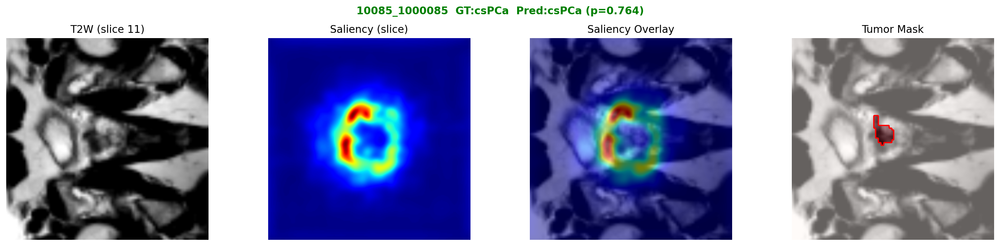
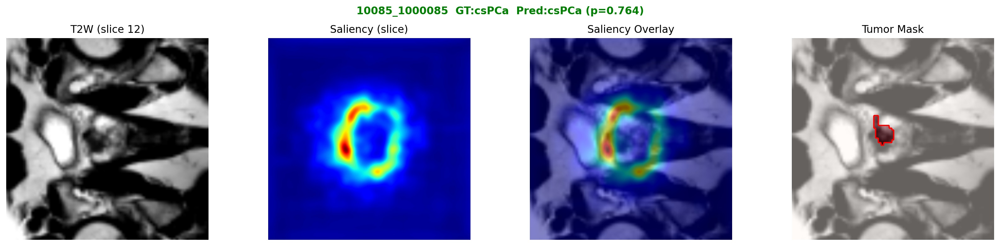
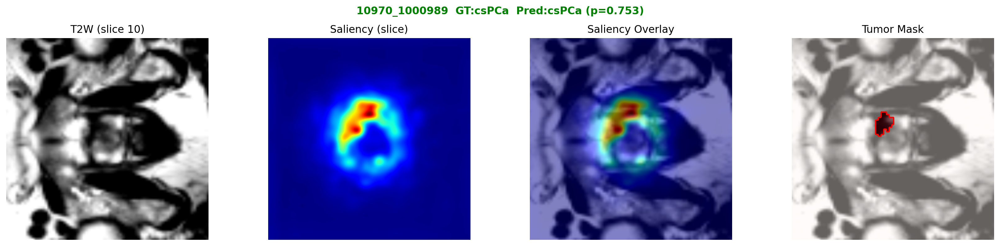
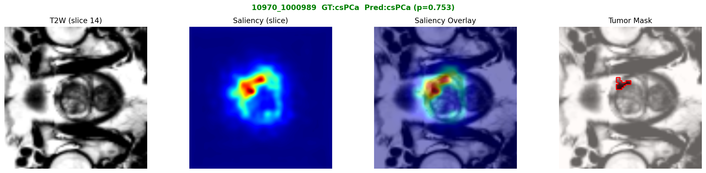
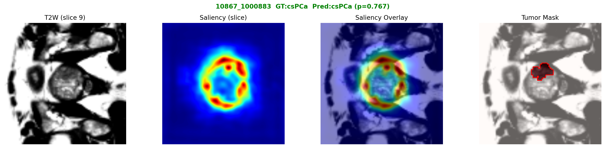
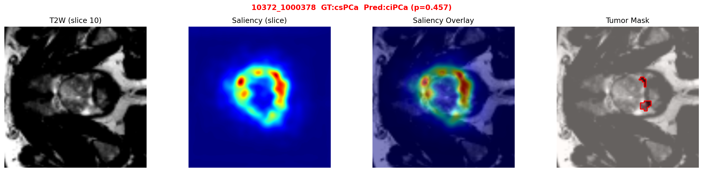
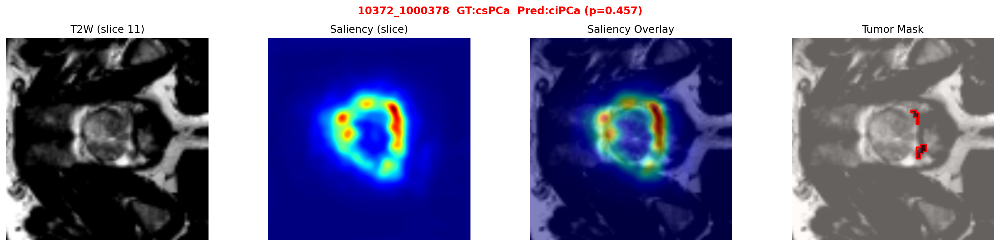
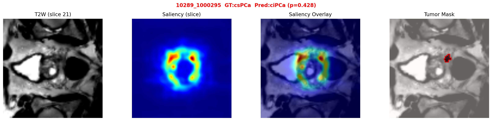
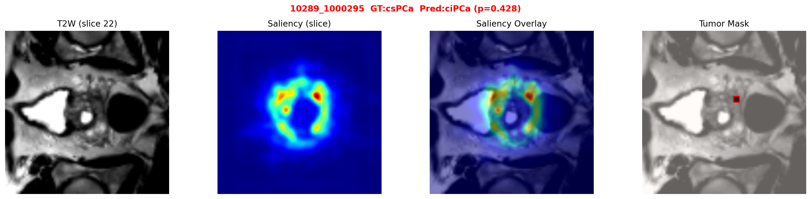

# MedImage

Medical image deep-learning research workspace with three independent projects:

| Project | Task | Dataset |
|---------|------|---------|
| **[ProstateCls/](ProstateCls/)** | Prostate cancer binary classification | PI-CAI (1,131 patients) |
| [MedViT/](MedViT/) | Medical image classification backbone | MedMNIST-2D / ImageNet |
| [SwinSegNet/](SwinSegNet/) | Colon gland segmentation | GlaS |

---

# PI-CAI Prostate Cancer Classification

Binary classification of multi-parametric prostate MRI: **csPCa** (clinically significant prostate cancer, ISUP ≥ 2, label 1) vs. **ciPCa** (clinically insignificant / benign, label 0).

## Dataset

**PI-CAI** — 1,131 patients, each with three aligned MRI volumes:

| Modality | Description |
|----------|-------------|
| T2W MRI | Anatomical reference, primary diagnostic image |
| ADC map | Apparent Diffusion Coefficient (registered to T2W) |
| Gland mask | Prostate segmentation (used as spatial prior) |

**Class imbalance** is the central challenge: csPCa makes up only **15.8%** of patients.

| Split | Patients | csPCa (1) | ciPCa (0) | Positive rate |
|-------|:--------:|:---------:|:---------:|:-------------:|
| Train | 791 | 125 | 666 | 15.8% |
| Val   | 170 | 27  | 143 | 15.9% |
| Test  | 170 | 27  | 143 | 15.9% |
| **Total** | **1,131** | **179** | **952** | **15.8%** |

Stratified split, `seed=42`. Patient-level splits (no slice leakage).

---

## Input Representation — Depth-as-Channel

All methods except MIL encode the 3D volume as a **96-channel 2D tensor**:

```
32 axial slices × 3 modalities (T2W, ADC, gland) = 96 channels
Channel order: [T2W₀, ADC₀, gland₀, T2W₁, ADC₁, gland₁, ..., T2W₃₁, ADC₃₁, gland₃₁]
Input shape: [B, 96, 224, 224]
```

**Weight Tiling**: The pretrained MedViT first conv (3 ch → 64) is inflated to 96 ch → 64 by tiling the pretrained weights 32 times and dividing by 32. This preserves pretrained feature extractors while extending to multi-slice input. All other backbone weights are frozen from ImageNet pretraining (backbone LR = 1e-5).

**Preprocessing per patient:**
1. Resample T2W + ADC + gland to 0.5 mm/px in-plane
2. Crop 80 mm FOV centered on gland centroid
3. Resize to 224 × 224
4. Within-gland percentile normalization (p1–p99) per modality
5. Select 32 axial slices centered on the volume midpoint

---

## Class Imbalance Strategies

With 15.8% positive rate, models tend to ignore csPCa. Four complementary strategies were explored:

| Strategy | Flag | Effect |
|----------|------|--------|
| **WeightedRandomSampler** | (default) | Oversample csPCa during training |
| **BalancedBatchSampler** | `--balanced-batch` | Force exactly 50% csPCa per mini-batch |
| **csPCa Oversample ×N** | `--cs-oversample N` | Repeat each csPCa patient N× per epoch with different augmentation |
| **Class-weighted loss** | `--cspca-weight W` | Multiply csPCa gradient by W (default ~3.5, inverse frequency) |
| **Focal loss** | `--focal-gamma G` | Down-weight easy ciPCa negatives, focus on hard cases |

**Key finding:** BalancedBatchSampler (strict 50/50 per batch, `wt_fbn_fbal`) gave the best test AUC (0.800) while cs_oversample×5 (`wt_os5`) maximized sensitivity (70.4%).

---

## Backbone: MedViT_small

All methods share MedViT_small as the feature extractor ([Nejati et al., 2023](https://arxiv.org/abs/2302.09462)) — a hierarchical CNN-Transformer hybrid pretrained on ImageNet.

```
Input [B, 96, 224, 224]
  ├─ Stem (stride 2+2)               →  [B,  64,  56, 56]
  ├─ Stage 1 — ECB ×3                →  [B,  96,  56, 56]   f1
  ├─ Stage 2 — ECB+LTB ×4, stride 2 →  [B, 256,  28, 28]   f2
  ├─ Stage 3 — ECB+LTB ×10, stride 2→  [B, 512,  14, 14]   f3
  └─ Stage 4 — ECB+LTB ×3, stride 2 →  [B, 1024,  7,  7]   f4
```

ECB = Efficient Conv Block · LTB = Local-Transformer Block (with MHCA attention)

---

## Methods

### 1. Weight Tiling — Depth-as-Channel Baseline

**Architecture:** MedViT_small → GAP → MLP `[1024 → 512 → 256 → 2]`

The simplest approach: stack all 96 channels and let MedViT learn cross-slice patterns. No structural changes to the backbone beyond the inflated first conv.

**Imbalance strategies tested:** BalancedBatchSampler, csPCa weight ×6, cs_oversample ×5, Focal loss, strong augmentation (hflip + rotation + intensity jitter).

---

### 2. Channel Adapter — Learnable Multi-Modal Recalibration

**Architecture:** 96-ch input → **Channel Adapter** → MedViT → GAP → MLP

Adds a learnable channel attention module (SE-style) between the inflated input and the backbone. The adapter learns which slices and modalities (T2W / ADC / gland) are most informative for each patient, rather than treating all 96 channels equally.

The adapter has its own LR (1e-4), intermediate between backbone (1e-5) and head (3e-4).

---

### 3. CNN Head — Spatial Attention on Feature Map

**Architecture:** MedViT → `[B, 1024, 7, 7]` → **CBAM** → GAP → MLP

Instead of immediately applying GAP after the backbone, the CBAM (Convolutional Block Attention Module) first recalibrates the 7×7 spatial feature map using:
- **Channel attention (SE block):** which of the 1024 feature channels matter
- **Spatial attention:** which of the 7×7 spatial locations matter (7×7 conv on max+avg pooled channels)

Tested with Focal loss (γ=2.0) to focus on hard csPCa cases.

---

### 4. Mask Guided — Prostate-Constrained Attention

**Architecture:** MedViT → `f4 * gland_gate` → CBAM → GAP → MLP

Uses the gland mask as a **spatial prior** to restrict attention to the prostate region. The gland mask is downsampled to 7×7 via adaptive avg pool and applied as a multiplicative gate on `f4` before CBAM:

```python
gland_7 = F.adaptive_avg_pool2d(gland_2d, 7)   # [B, 1, 7, 7]
f4_gated = f4 * (gland_7 + 1e-3)               # epsilon keeps ciPCa gradients alive
```

The `+1e-3` ensures features outside the gland are not fully zeroed, preserving gradient flow for ciPCa patients.

---

### 5. Seg+Cls — Tumor Segmentation as Spatial Supervision

**Architecture:** MedViT (multi-scale hooks) + U-Net decoder + tumor-gated classification head

The key hypothesis: if the model is forced to **locate the tumor** (segmentation task), it will also learn to classify better. The model predicts tumor segmentation and csPCa simultaneously.

```
MedViT backbone → f1[96,56,56], f2[256,28,28], f3[512,14,14], f4[1024,7,7]
  → U-Net decoder (f4→f3→f2→f1 skip connections) → tumor_pred [B,1,224,224]
  → tumor_pred gates f4: f4_gated = f4 * gland_7 * (1 + tumor_7)
  → CBAM → GAP + seg_proj(tumor_pred) → MLP → cls logits
```

**Key design:** `tumor_pred` is **not detached** when used as the spatial gate on `f4`. This means classification gradients flow back through the tumor prediction into the U-Net decoder — the decoder is trained by both segmentation loss (Dice+BCE) and classification loss simultaneously.

**Loss:** `total_loss = cls_loss + 0.5 × seg_loss`

---

### 6. MIL-ABMIL — Multiple Instance Learning

**Architecture:** Shared MedViT_small (3-ch per slice) + Gated Attention pooling → MLP

Instead of depth-as-channel, each slice is processed **independently** through a shared MedViT:

```
[slice_0, slice_1, ..., slice_31]  each [B, 3, 224, 224]
  → shared MedViT → feat_i [B, 1024]  (i = 0..31)
  → GatedABMIL: attention weights a_i = softmax(W_a tanh(W_v h_i) ⊙ sigmoid(W_u h_i))
  → z = Σ a_i · feat_i  →  MLP  →  cls logits
```

This avoids the 96-channel DataParallel memory alignment issue and lets the model identify **which slices** are most predictive via learned attention weights. However, it loses cross-slice context.

Tested with attention regularization (`--attn-lambda 0.1`) to spread attention across slices rather than collapsing to a few.

---

## Results

Test set: 170 patients (csPCa=27, ciPCa=143). All 16 trained runs ranked by Test AUC.

| Method | Run | Val AUC | **Test AUC** | Sens@0.5 | Spec@0.5 | TP | FN | Youden thr | Sens@Y | Spec@Y |
|--------|-----|--------:|------------:|---------:|---------:|---:|---:|----------:|-------:|-------:|
| weight_tiling | **wt_fbn_fbal** | 0.774 | **0.800** | 55.6% | 78.3% | 15 | 12 | 0.367 | 81.5% | 72.7% |
| channel_adapter | **ca_os5** | 0.700 | **0.762** | 37.0% | 84.6% | 10 | 17 | 0.007 | 63.0% | 72.7% |
| mil_abmil | **baseline** | 0.792 | **0.759** | 92.6% | 42.0% | 25 | 2  | 0.876 | 74.1% | 65.7% |
| mil_abmil | attn01 | 0.854 | 0.743 | 18.5% | 93.0% | 5  | 22 | 0.000 | 70.4% | 58.0% |
| cnn_head | **cnn_fbn_focal** | 0.814 | **0.739** | 40.7% | 86.7% | 11 | 16 | 0.024 | 63.0% | 74.1% |
| weight_tiling | wt_fbn | 0.848 | 0.734 | 37.0% | 92.3% | 10 | 17 | 0.000 | 44.4% | 82.5% |
| weight_tiling | wt_fbn_cos | 0.864 | 0.728 | 33.3% | 90.2% | 9  | 18 | 0.000 | 48.1% | 81.1% |
| weight_tiling | wt_os5 | 0.798 | 0.729 | 70.4% | 65.0% | 19 | 8  | 0.824 | 55.6% | 72.7% |
| weight_tiling | wt_aug | 0.755 | 0.723 | 33.3% | 88.1% | 9  | 18 | 0.084 | 40.7% | 81.1% |
| weight_tiling | wt_cw6_aug | 0.797 | 0.720 | 29.6% | 88.1% | 8  | 19 | 0.001 | 77.8% | 65.0% |
| cnn_head | cnn_os5 | 0.807 | 0.717 | 33.3% | 81.1% | 9  | 18 | 0.004 | 74.1% | 65.0% |
| mil_abmil | mil_os5 | 0.778 | 0.713 | 92.6% | 48.2% | 25 | 2  | 0.982 | 55.6% | 70.6% |
| weight_tiling | wt_cw6 | 0.797 | 0.679 | 37.0% | 77.6% | 10 | 17 | 0.017 | 55.6% | 62.2% |
| mask_guided | **mg_fbn_bal** | 0.825 | **0.710** | 48.1% | 80.4% | 13 | 14 | 0.999 | 40.7% | 83.9% |
| weight_tiling | wt_os5_cw4 | 0.762 | 0.649 | 22.2% | 81.8% | 6  | 21 | 0.002 | 63.0% | 66.4% |
| mask_guided | mg_os5 | 0.734 | 0.603 | 14.8% | 87.4% | 4  | 23 | 0.000 | 40.7% | 65.7% |
| seg_cls | **seg_fbn_bal_d02** | 0.773 | **0.735** | 63.0% | 65.7% | 17 | 10 | 0.269 | 77.8% | 46.2% |
| seg_cls | seg_fbn_fbal | — | *pending* | — | — | — | — | — | — | — |
| seg_cls | seg_fbn_focal | — | *pending* | — | — | — | — | — | — | — |
| seg_cls | seg_fbn_focal_d02 | — | *pending* | — | — | — | — | — | — | — |
| seg_cls | seg_os5 | — | *pending* | — | — | — | — | — | — | — |

**Bold run** = best per method. TP/FN out of 27 csPCa test patients.

### Key Observations

- **BalancedBatchSampler** (`wt_fbn_fbal`, AUC 0.800) outperforms WeightedRandomSampler alone — strict 50/50 per batch provides more stable gradient signal for the minority class.
- **Val AUC does not predict Test AUC**: `wt_fbn_cos` achieves val AUC 0.864 but test AUC only 0.728 — the 15.8% minority class causes the model to overfit val. Test AUC is the reliable metric.
- **MIL baseline** achieves the highest sensitivity at thr=0.5 (92.6%, only 2 FN out of 27 csPCa) at the cost of specificity (42%). When minimizing FN is the clinical priority, MIL is the best option.
- **Youden threshold = 0.000** in several runs means the model predicts csPCa for nearly all patients — a sign of class imbalance instability rather than useful calibration.
- **cs_oversample ×5** improves sensitivity (wt_os5: 70.4% vs wt_fbn: 37.0%) but hurts specificity — more csPCa examples per epoch increases recall at the cost of false positives.

---

## Visualizations

### Best model: `wt_fbn_fbal` (Test AUC 0.800)

| ROC & PR Curve | Learning Curve | Confusion Matrix |
|:-:|:-:|:-:|
|  |  |  |

### Grad-CAM: `wt_fbn_fbal` — csPCa Examples

Each row shows: **T2W MRI · Saliency map · Saliency overlay · Tumor mask** (red contour).  
Green title = True Positive · Red title = False Negative (missed).

**Patient 10085** · Slice 11 (TP, p=0.764)


**Patient 10085** · Slice 12 (TP, p=0.764)


**Patient 10970** · Slice 10 (TP, p=0.753) — strong focal alignment with tumor


**Patient 10970** · Slice 14 (TP, p=0.753)


**Patient 10867** · Slice 9 (TP, p=0.767)


**Patient 10372** · Slice 10 (FN, p=0.457) — missed csPCa


**Patient 10372** · Slice 11 (FN, p=0.457)


**Patient 10289** · Slice 21 (FN, p=0.428)


**Patient 10289** · Slice 22 (FN, p=0.428)


---

## Other Projects

### MedViT

CNN-Transformer hybrid backbone for 2D medical image classification on MedMNIST and ImageNet-style datasets. Supports distributed multi-GPU training, Mixup/CutMix augmentation, and knowledge distillation. Three variants: `MedViT_small`, `MedViT_base`, `MedViT_large`.

See [MedViT/](MedViT/) for training scripts and [MedViT/MedViT.py](MedViT/MedViT.py) for the full architecture.

### SwinSegNet

Swin Transformer V2 U-Net for colon gland segmentation on the GlaS dataset. Encoder uses `swinv2_tiny_window8_256` (via timm), decoder uses RFB blocks + CBAM attention. Loss: `0.7 × BCE + 0.3 × IoU`.

See [SwinSegNet/](SwinSegNet/) for Jupyter notebooks.
