# PI-CAI Prostate Cancer Classification

Binary classification of clinically significant prostate cancer (csPCa) from multi-parametric MRI using MedViT-based deep learning models.

---

## Task

| | |
|---|---|
| **Dataset** | PI-CAI (Prostate Imaging: Cancer AI) |
| **Task** | Patient-level binary classification: csPCa (ISUP ≥ 2) vs. ciPCa (ISUP 0–1 / benign) |
| **Modalities** | T2W · ADC (registered to T2W) · Gland mask |
| **Positive class** | csPCa = 1 &nbsp;&nbsp; Negative class = ciPCa = 0 |

---

## Dataset

| Split | Patients | csPCa | ciPCa | Positive rate |
|-------|----------|-------|-------|---------------|
| Train | 791 | 125 | 666 | 15.8% |
| Val   | 170 | 27  | 143 | 15.9% |
| Test  | 170 | 27  | 143 | 15.9% |
| **Total** | **1,131** | **179** | **952** | **15.8%** |

Single stratified split, `seed=42`. Patient-level (no slice leakage).

**Preprocessing (all methods):**
1. Resample T2W + ADC + gland in-plane to **0.5 mm/px** (bilinear; gland re-binarized)
2. Crop a fixed **80 mm FOV** centered on the gland centroid (XY)
3. Resize to **224 × 224**
4. Within-gland percentile normalization (p1–p99) separately for T2W and ADC
5. Select **32 axial slices** centered on the volume midpoint

---

## Methods

Seven classification approaches, each in its own sub-directory under `ProstateCls/`.

### 1. Weight Tiling (`weight_tiling/`)

**Input:** `[B, 96, 224, 224]` — 32 slices × 3 modalities interleaved channel-by-channel.

**Backbone:** MedViT_small pre-trained on ImageNet. First convolution inflated 3 → 96 channels by tiling pre-trained weights (÷ 32). All other backbone layers retain pretrained values.

**Head:** MLP — `1024 → 512 → 256 → 2` (GELU, Dropout 0.2).

The simplest depth-as-channel baseline.

---

### 2. Channel Adapter (`channel_adapter/`)

Same depth-as-channel input as weight_tiling. Adds a learnable **channel attention adapter** before the backbone that recalibrates the 96-channel input across modalities and slices, then passes through the standard MedViT + MLP head.

---

### 3. Mask-Guided (`mask_guided/`)

**Two-stream architecture:**
- **Image stream:** MedViT processes `[B, 96, 224, 224]` → `[B, 1024]`
- **Mask stream:** lightweight CNN on `[B, 32, 224, 224]` gland-only volume → `[B, 256]`
- **Fusion:** concatenate → `[B, 1280]` → MLP → 2

---

### 4. Mask BBox (`mask_bbox/`)

Instead of a fixed 80 mm FOV crop, crops a tight **bounding box around the gland** (with 20 mm margin), then resizes to 224 × 224. Otherwise identical to mask_guided.

---

### 5. Slice Transformer (`slice_transformer/`)

Processes each of the 32 axial slices independently through a **shared** MedViT_small (3-channel). A lightweight **cross-slice transformer** (2 layers, 8 heads) aggregates the 32 per-slice feature vectors into a patient-level embedding.

---

### 6. Slice Wise MIL (`slice_wise/`)

Same per-slice encoding as slice_transformer, but uses **Multiple Instance Learning (MIL)** with max-pooling aggregation. The patient-level score is the maximum csPCa logit across all 32 slices.

---

### 7. CNN Head (`cnn_head/`)

MedViT backbone is run up to its pre-pool stage, exposing a **`[B, 1024, 7, 7]` spatial feature map**. A CNN-based classification head processes the spatial structure directly:

| Variant | Head |
|---------|------|
| `cnn_se` | Squeeze-and-Excitation (channel) → GAP → FC |
| `cnn_cbam` | CBAM (SE + 7×7 spatial attention) → GAP → FC |
| `cnn_gem` | CBAM + Generalized Mean Pooling (learnable p) → FC |
| `cnn_ms` | Multi-scale DW conv (1×1/3×3/5×5/7×7, residual) + CBAM → GAP → FC |

---

## Results

Best test set result per method (threshold = 0.5, test n = 170, csPCa = 27):

| Method | Best Run | AUC-ROC | Sensitivity | Specificity | F1 | TP / 27 |
|--------|----------|---------|-------------|-------------|-----|---------|
| weight_tiling | `wt_warmup` | 0.8156 | 0.667 | 0.755 | 0.450 | 18 |
| channel_adapter | `adapter_lrbal` | 0.7674 | 0.815 | 0.706 | 0.484 | 22 |
| mask_guided | `mask_noflip` | **0.8427** ★ | **0.926** | 0.692 | **0.521** | 25 |
| mask_bbox | `bbox_cw_lo` | 0.7920 | 0.296 | **0.909** | 0.333 | 8 |
| slice_transformer | `slice_tf_warmup` | 0.7470 | 0.185 | 0.972 | 0.278 | 5 |
| slice_wise | `slice_wise_cosine` | 0.7700 | 0.778 | 0.629 | 0.416 | 21 |
| cnn_head | `cnn_cbam` | 0.8208 | 0.593 | 0.797 | 0.444 | 16 |

★ **Overall best: `mask_guided / mask_noflip` — AUC 0.8427, Sensitivity 0.926** (25/27 csPCa detected)

---

## Grad-CAM: Correctly Detected csPCa Cases per Method

Each animation cycles through all 32 axial slices showing **T2W · Grad-CAM overlay · Tumor mask** (red contour). All patients shown are True Positives at threshold = 0.5. Depth-as-channel methods (wt/ca/mg/mb/cnn) use the aggregate spatial heatmap; slice_wise recomputes Grad-CAM independently per slice.

---

### Weight Tiling — `wt_warmup` (18 / 27 TP)

| Learning Curve | ROC/PR |
|----------------|--------|
|  |  |

**Patient 10019**
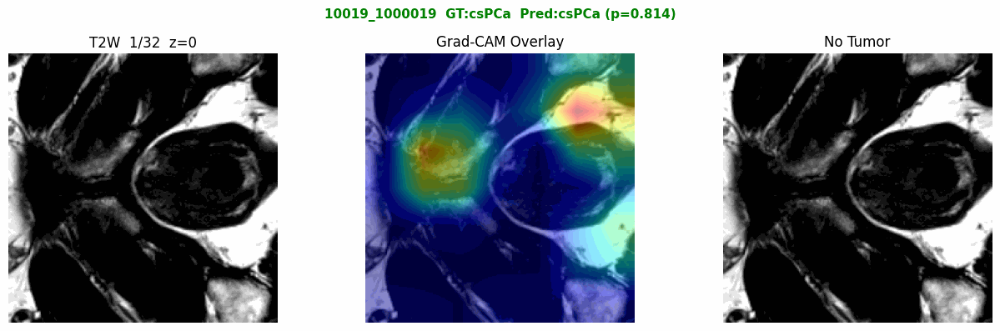

**Patient 10085**
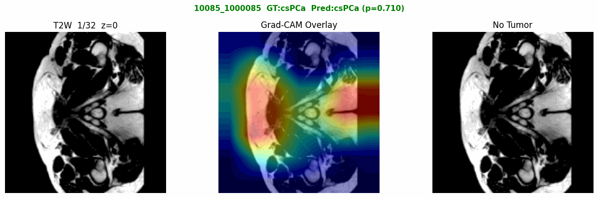

**Patient 10220**
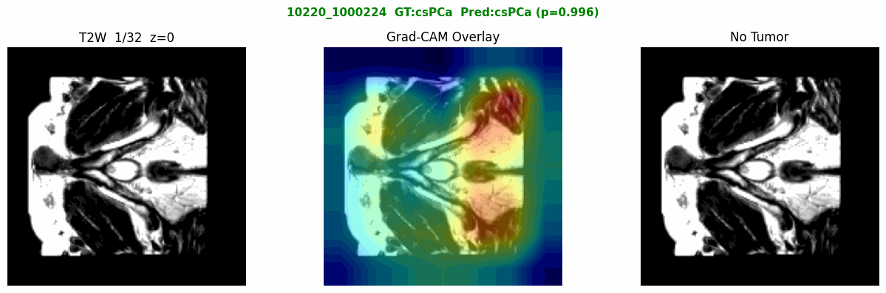

---

### Channel Adapter — `adapter_lrbal` (22 / 27 TP)

| Learning Curve | ROC/PR |
|----------------|--------|
| 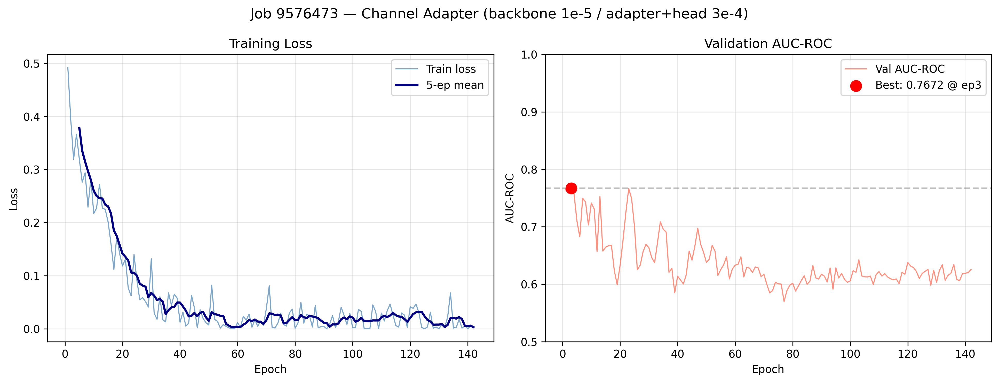 | 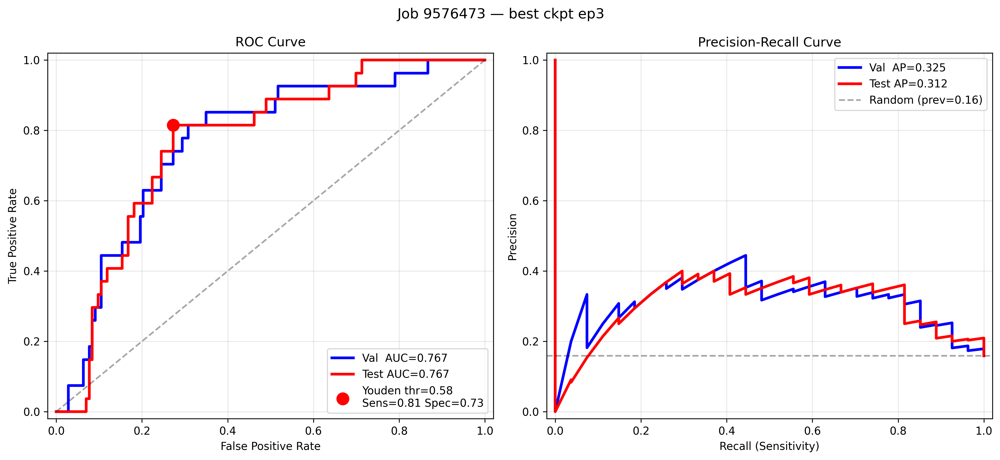 |

**Patient 10085**
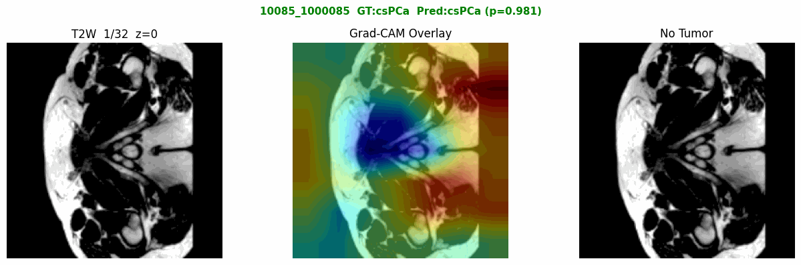

**Patient 10220**
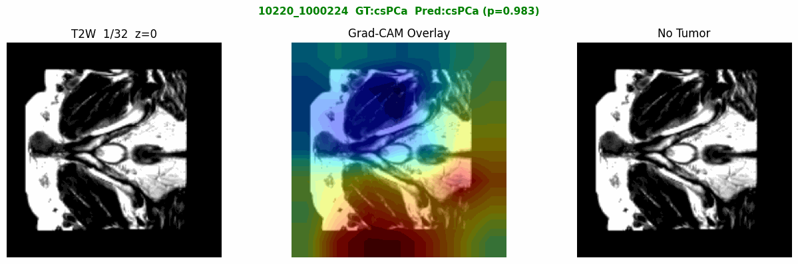

**Patient 10626**
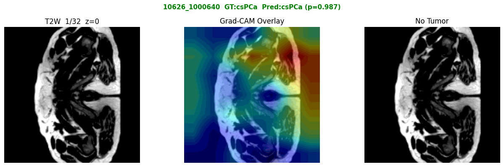

---

### Mask-Guided — `mask_noflip` (25 / 27 TP) ★ Best Overall

| Learning Curve | ROC/PR | Confusion Matrix |
|----------------|--------|-----------------|
|  |  |  |

**Patient 10085**
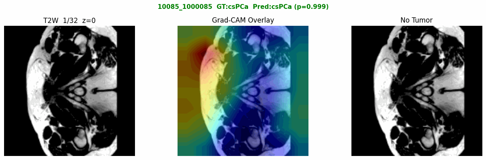

**Patient 10220**
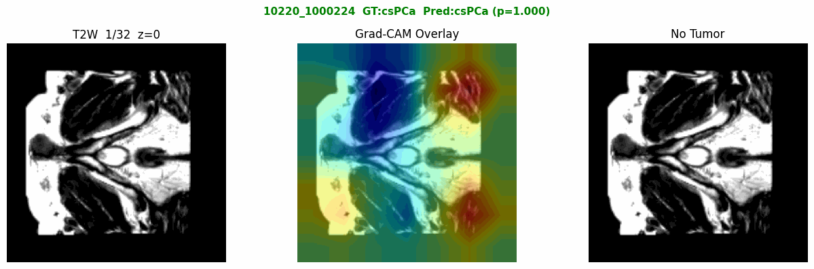

**Patient 10626**
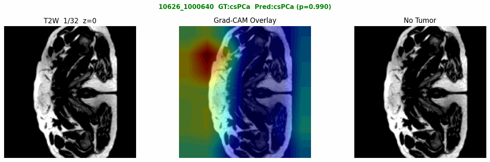

---

### Mask BBox — `bbox_cw_lo` (8 / 27 TP)

| Learning Curve | ROC/PR |
|----------------|--------|
|  |  |

**Patient 10085**
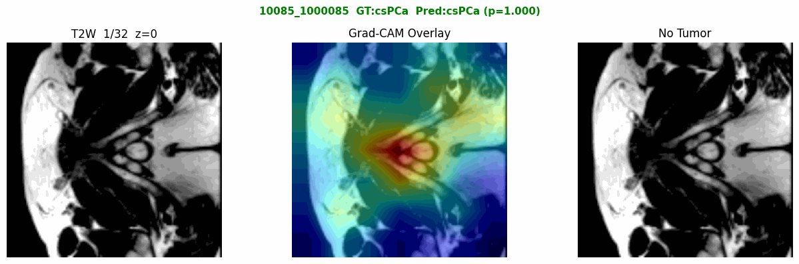

**Patient 10442**
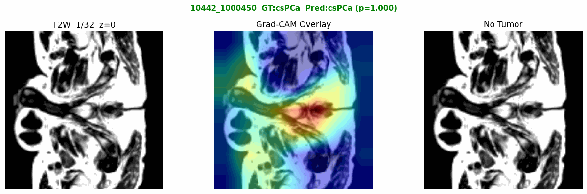

**Patient 10626**
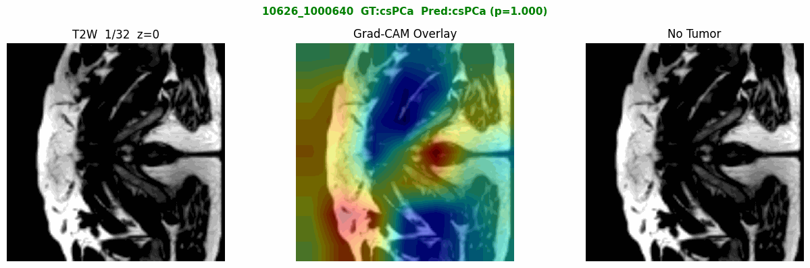

---

### Slice Transformer — `slice_tf_warmup` (5 / 27 TP)

Grad-CAM is not applicable to the slice transformer architecture.

| Learning Curve | ROC/PR |
|----------------|--------|
| 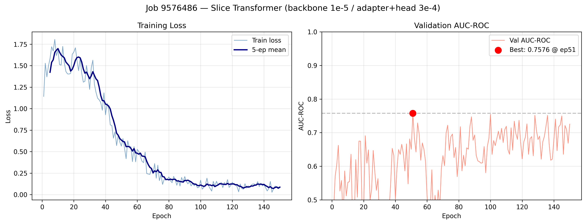 | 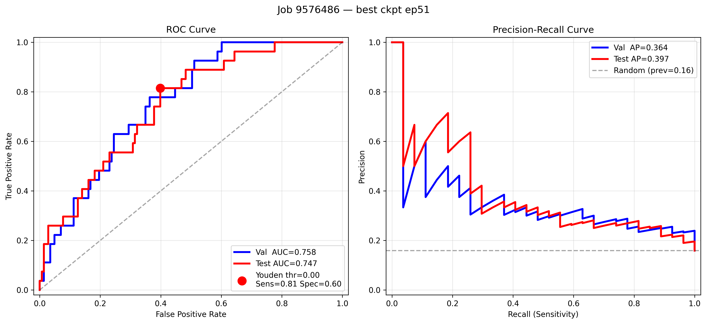 |

---

### Slice Wise MIL — `slice_wise_cosine` (21 / 27 TP)

Per-slice Grad-CAM: each frame shows the heatmap recomputed independently for that slice through the shared MedViT backbone.

| Learning Curve | ROC/PR |
|----------------|--------|
| 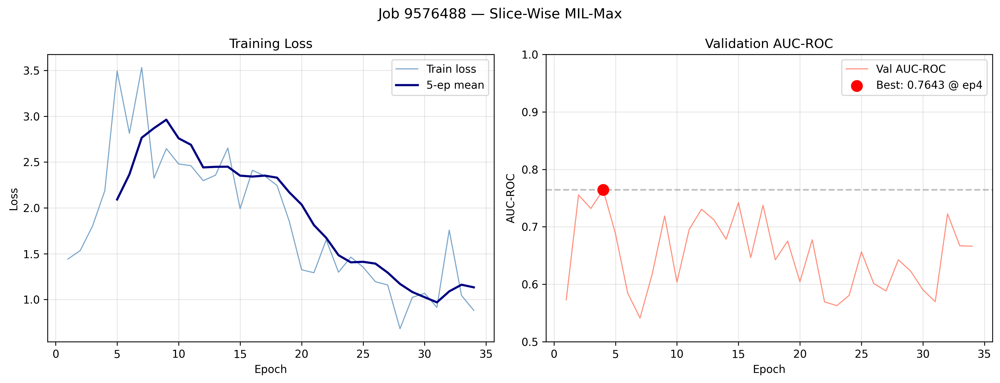 | 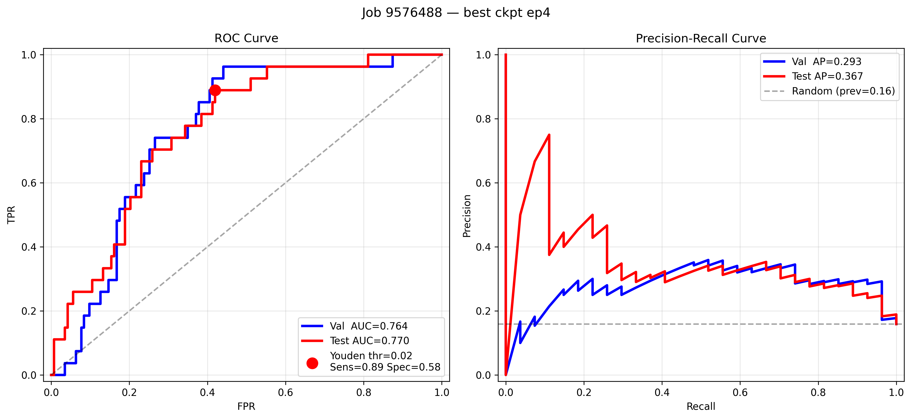 |

**Patient 10085**
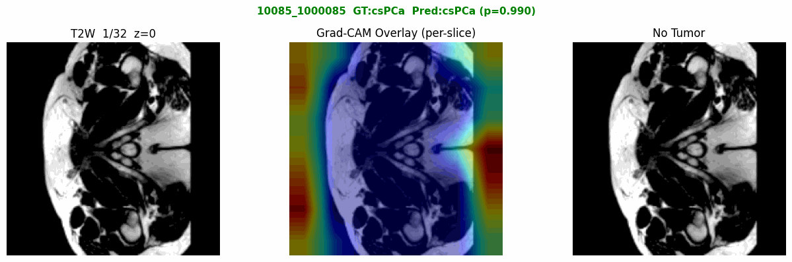

**Patient 10220**
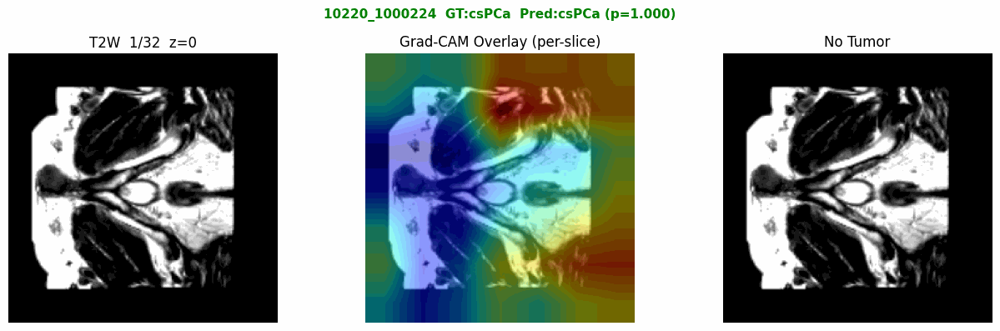

**Patient 10626**
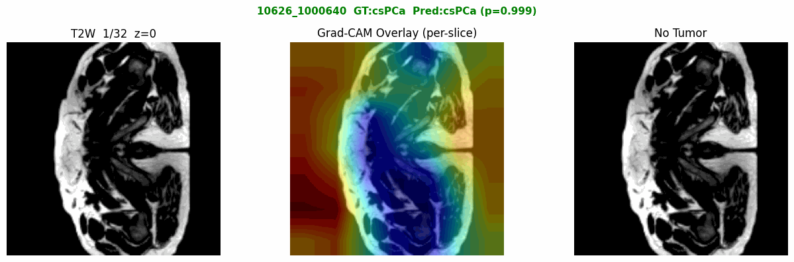

---

### CNN Head — `cnn_cbam` (16 / 27 TP)

CNN attention head on `[B, 1024, 7, 7]` spatial feature map — CBAM (SE + 7×7 spatial attention) variant.

| Learning Curve | ROC/PR |
|----------------|--------|
| 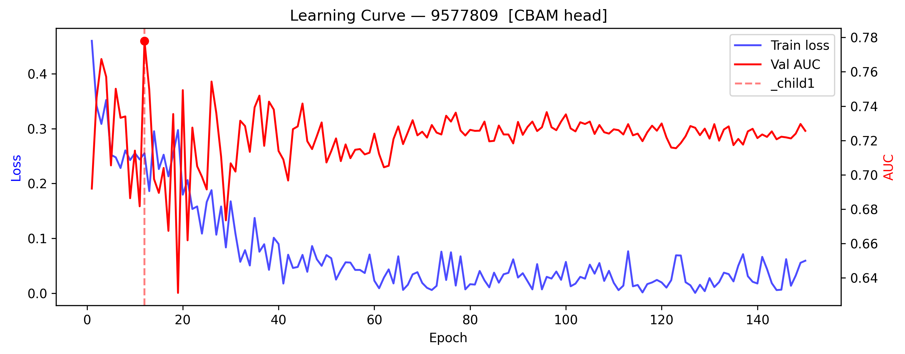 | 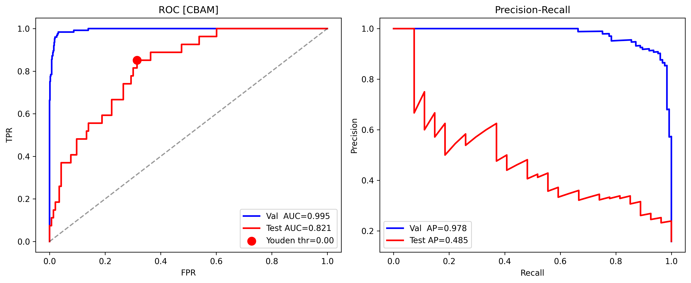 |

**Patient 10085**
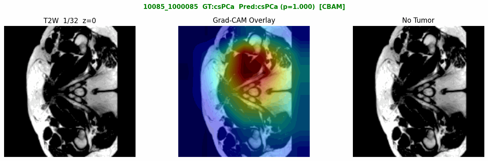

**Patient 10220**
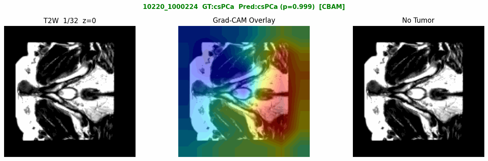

**Patient 10626**
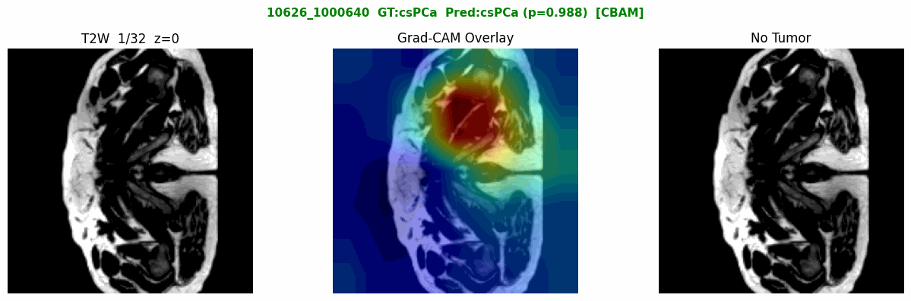

---

## Training Details

| Hyperparameter | Value |
|---------------|-------|
| Optimizer | AdamW |
| Backbone LR | 1e-5 (pretrained params) |
| Head / new-layer LR | 3e-4 |
| Weight decay | 1e-4 |
| Scheduler | ReduceLROnPlateau (factor=0.5, patience=10) |
| Max epochs | 150 |
| Early stopping | patience=30 (val AUC) |
| Batch size | 8 |
| Grad clip | max_norm=1.0 |
| Class weights | auto inverse-frequency (ciPCa ≈ 0.59, csPCa ≈ 3.16) |
| Sampler | WeightedRandomSampler (class-balanced oversampling) |
| Input size | 224 × 224 |
| Slices per patient | 32 |

---

## Architecture: MedViT Backbone

MedViT ([Nejati et al., 2023](https://arxiv.org/abs/2302.09462)) is a hierarchical CNN-Transformer hybrid:

```
Input [B, 96, 224, 224]
  │
  ├─ Stem (4× ConvBNReLU, stride 2+2)   → [B, 64, 56, 56]
  │
  ├─ Stage 1 (3× ECB, stride 1)          → [B,  96, 56, 56]
  ├─ Stage 2 (4× ECB+LTB, stride 2)      → [B, 256, 28, 28]
  ├─ Stage 3 (10× ECB+LTB, stride 2)     → [B, 512, 14, 14]
  └─ Stage 4 (3× ECB+LTB, stride 2)      → [B, 1024, 7, 7]
       │
       ├─ [weight_tiling / channel_adapter / mask_guided / mask_bbox / slice_wise]
       │    AdaptiveAvgPool(1,1) → flatten → [B, 1024]
       │    MLP: 1024 → 512 → 256 → 2
       │
       └─ [cnn_head]
            CNN attention head (SE / CBAM / GeM / MS) → [B, 2]
```

**Weight inflation**: pretrained 3-channel first conv `[64, 3, 3, 3]` tiled to `[64, 96, 3, 3]` and divided by 32.

---

## References

- **MedViT:** Nejati O. et al., *MedViT: A Robust Vision Transformer for Generalized Medical Image Classification*, CVPR 2023. [arXiv:2302.09462](https://arxiv.org/abs/2302.09462)
- **PI-CAI:** Saha A. et al., *Artificial Intelligence and Radiologists at Prostate Cancer Detection in MRI*, Radiology 2023. [DOI:10.1148/radiol.220029](https://doi.org/10.1148/radiol.220029)
- **CBAM:** Woo S. et al., *CBAM: Convolutional Block Attention Module*, ECCV 2018.
- **GeM Pooling:** Radenović F. et al., *Fine-Tuning CNN Image Retrieval with No Human Annotation*, TPAMI 2019.
